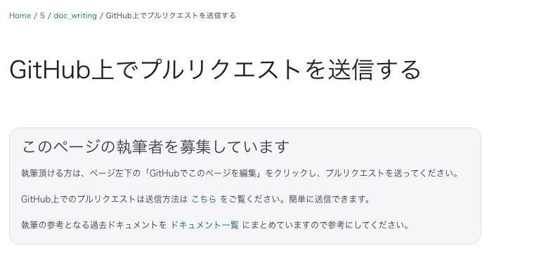

# GitHub上でプルリクエストを送信する

ドキュメントはgithub上で管理していますので、以下のパターンで、編集したドキュメントをプルリクエストにてお届けください。  
プルリクエストをお送りいただく際は、ご自身のgithubアカウント上で、 https://github.com/baserproject/baserproject.github.io をフォークした上で、行います。

## 全体の流れ

- githubで https://github.com/baserproject/baserproject.github.io をご自身のアカウントにフォークする
- masterブランチからトピックブランチを作成する
- 作成したトピックブランチで更新を行い、フォークしたプロジェクトにプッシュする
- baserproject に対して、プルリクエストを送る

## 既存ページに対する更新

ドキュメント用githubプロジェクトで、マージ権限をお持ちかそうでない場合で分かれます。

### マージ権限をお持ちでない方の場合

「全体の流れ」に沿って、プルリクエストを作成してお届けください。

### マージ権限をお持ちの場合

- A. masterブランチにマージした上で、リモート側にプッシュしてください
- B. github上でプルリクエストを作成した上で、マージ実施してください

A、B どちらのパターンでも良いです。

## 新規ページに対する更新

新規ページには、以下の執筆者を募集しているケースを含みます。

### マージ権限の有無に関わらず以下の手順

「全体の流れ」に沿って、プルリクエストを作成してお届けください。
