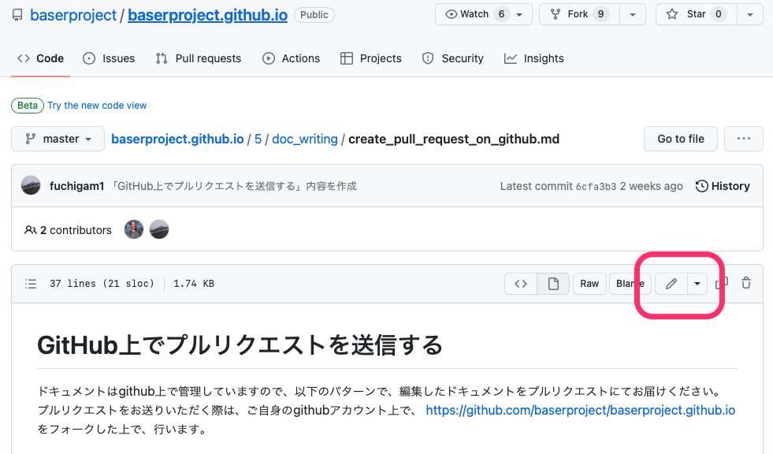
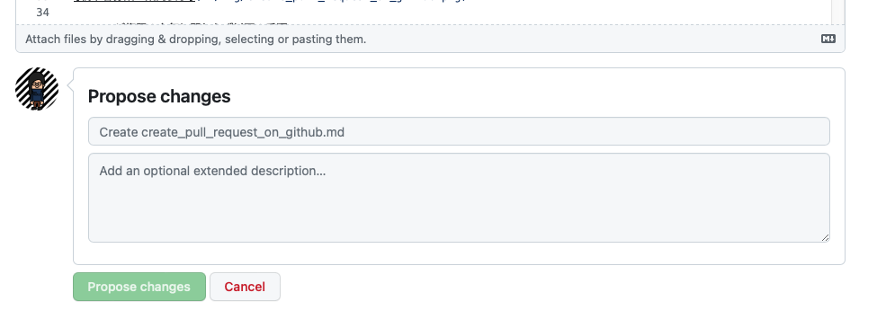

# GitHub上で直接編集する

ドキュメントは GitHub 上で管理していますので、各対象ファイルにて直接編集することも可能です。

権限がない場合は、自動的にフォークが作成され、プルリクエストの形式で送信することができます。

## 手順

- GitHub上の https://github.com/baserproject/baserproject.github.io にブラウザでアクセスする
- 編集アイコンをクリックする（鉛筆マークのアイコン）

- ブラウザ上で編集する
- 「Propose changes」に入力して送信する
    - 1行目には、編集内容を簡潔に示すタイトル内容を入力
	- 2行目には、編集内容の概要内容を入力

