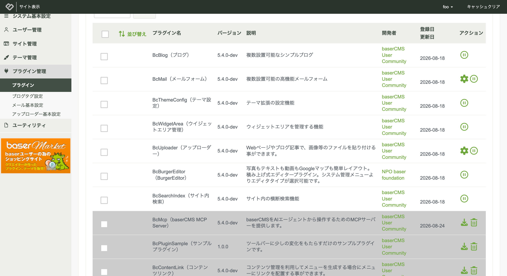
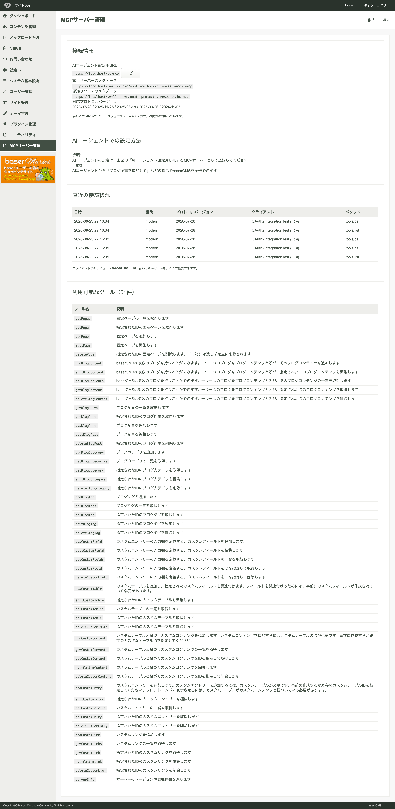
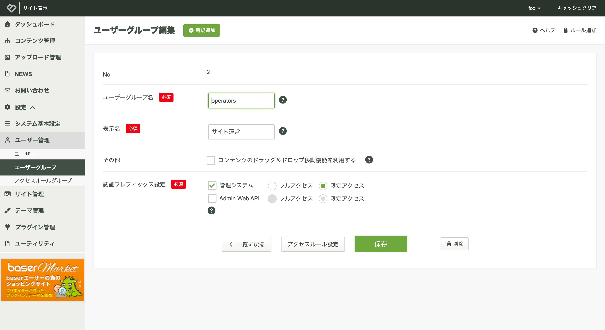

# AIエージェント連携

baserCMSは、AIエージェントからサイトのコンテンツを操作するための窓口を提供します。ClaudeやChatGPTなどのチャット画面から、会話でコンテンツを作成したり編集したりできます。

この窓口は MCP（Model Context Protocol）という規格に沿っています。MCPは、AIエージェントと外部サービスをつなぐための共通仕様です。

## 機能の概要
AIエージェントをbaserCMSに接続すると、次のような指示でサイトを操作できます。

```
「News」というブログに「AIの未来について」というタイトルで記事を作成して
```

```
会社概要の固定ページを作って、事業内容の説明を入れて
```

操作できる範囲は、次の3種類のコンテンツです。それぞれ取得・作成・編集・削除に対応します。

- 固定ページ
- ブログ（ブログ記事、ブログ、ブログカテゴリ、ブログタグ）
- カスタムコンテンツ（カスタムコンテンツ、カスタムエントリー、カスタムフィールド、カスタムテーブル、カスタムリンク）

AIエージェントは、連携を許可したユーザーの権限で動作します。管理画面でできない操作は、AIエージェントからもできません。

## 事前準備
### プラグインの有効化
AIエージェント連携は「BcMcp」プラグインが提供します。baserCMSに同梱されていますが、初期状態では無効です。

管理画面の「設定」→「プラグイン管理」から「BcMcp」をインストールしてください。



プラグインの操作方法は「[プラグイン管理](./plugin)」を参照してください。

### HTTPS化
**AIエージェントを接続するには、サイトがHTTPSで公開されている必要があります。**

多くのAIエージェントは、自己署名証明書のサーバーに接続できません。正式な証明書を設置してください。

### フォルダの書き込み権限
認証情報を保存するため、ルート直下の「config」フォルダと「.env」ファイルに書き込み権限が必要です。

```shell
chmod 777 config
chmod 666 config/.env
```

## 接続用URLの確認
管理画面の「設定」→「MCPサーバー管理」を開きます。



「接続情報」の「AIエージェント設定用URL」が、AIエージェントに登録するURLです。「コピー」ボタンでコピーできます。

URLは次の形式です。

```
https://example.com/bc-mcp
```

この画面では、他に次の内容を確認できます。

| 項目 | 内容 |
|---|---|
| 認可サーバーのメタデータ | 認証に関する情報の公開先 |
| 保護リソースのメタデータ | 保護されたリソースに関する情報の公開先 |
| 対応プロトコルバージョン | 対応しているMCPの世代 |
| 直近の接続状況 | 接続してきたAIエージェントの記録 |
| 利用可能なツール | AIエージェントが実行できる操作の一覧 |

接続がうまくいかない場合は「直近の接続状況」を確認してください。接続の記録が残っていない場合、AIエージェントからbaserCMSへ到達できていません。

## AIエージェントの設定
### Claude
Claude Pro以上の契約が必要です。

1. 「MCPサーバー管理」より「AIエージェント設定用URL」をコピーします
2. Claudeの「設定」→「コネクタ」→「カスタムコネクタを追加」を開きます
3. 次のように設定します
    - 名前：任意の名前
    - リモートMCPサーバーURL：コピーしたURL
4. 「連携」をクリックします
5. baserCMSの画面に移動しますので、「許可」をクリックします

### ChatGPT
ChatGPT Plus以上の契約が必要です。

1. 「MCPサーバー管理」より「AIエージェント設定用URL」をコピーします
2. ChatGPTの「設定」→「コネクタ」→「高度な設定」を開き、「開発者モード」を有効にします
3. 「コネクタ」に戻り、「作成する」から次のように設定します
    - 名前：任意の名前
    - 説明：任意の説明
    - MCPサーバーのURL：コピーしたURL
    - 認証：OAuth
    - 「わたしはこのアプリケーションを信頼します」にチェックを入れます
4. 「作成する」をクリックします
5. baserCMSの画面に移動しますので、「許可」をクリックします

チャット画面では、開発者モードを有効にしたうえで、作成したコネクタを選択してください。

### Visual Studio Code
「mcp.json」に次のように設定します。ファイルの場所は、ユーザー設定またはプロジェクト内の「.vscode」フォルダです。

```json
{
    "servers": {
        "basercms": {
            "url": "AIエージェント設定用URL",
            "type": "http"
        }
    }
}
```

### その他のAIエージェント
HTTPでの接続に対応したMCPクライアントであれば利用できます。「AIエージェント設定用URL」をMCPサーバーのURLとして登録してください。

## 権限について
AIエージェントは、連携を許可する際にログインしたユーザーの権限で動作します。権限は Admin Web API の設定に従います。

システム管理グループのユーザーは、そのまま利用できます。それ以外のグループのユーザーで利用する場合は、次の設定が必要です。

1. 管理画面の「設定」→「ユーザー管理」→「ユーザーグループ」を開きます
2. 対象のグループを編集します
3. 「認証プレフィックス設定」の「Admin Web API」にチェックを入れます
4. 「フルアクセス」か「限定アクセス」を選び、保存します



「限定アクセス」を選んだ場合は、「アクセスルール設定」から操作を許可する範囲を調整します。設定方法は「[アクセスルール管理](./access_rule)」を参照してください。

## 画像の扱い
ブログ記事のアイキャッチなどの画像は、パソコン内のファイルを直接アップロードできません。次のいずれかの方法で指定してください。

- 公開されている画像のURLを伝える
- 「AIエージェント設定用URL」とは別に、管理画面から画像をアップロードしておく

これはbaserCMS側の制約ではありません。AIエージェント側に、ファイルの中身をサーバーへ渡す仕組みがまだ用意されていないためです。MCPの仕様として検討が進んでいますので、対応が済み次第baserCMSも追随します。

## 注意事項
AIエージェントは会話の内容に応じて操作を実行します。**削除を含む操作も指示できますので、公開中のサイトで利用する場合は注意してください。**

不要になった場合は、AIエージェント側でコネクタを削除してください。あわせて、baserCMSのプラグイン管理から「BcMcp」を無効にすると、接続用URLも使えなくなります。
