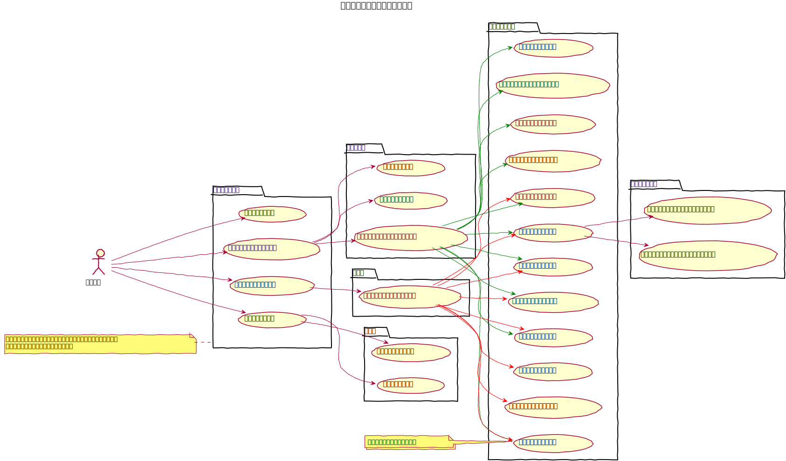
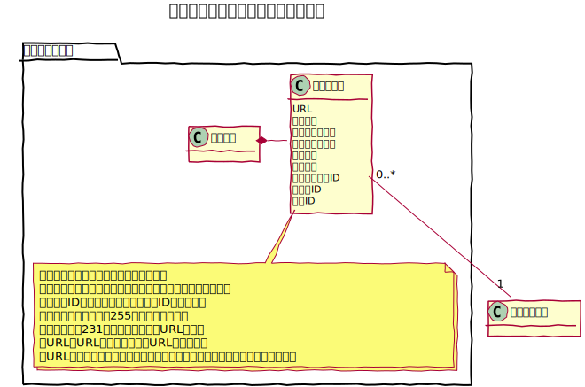
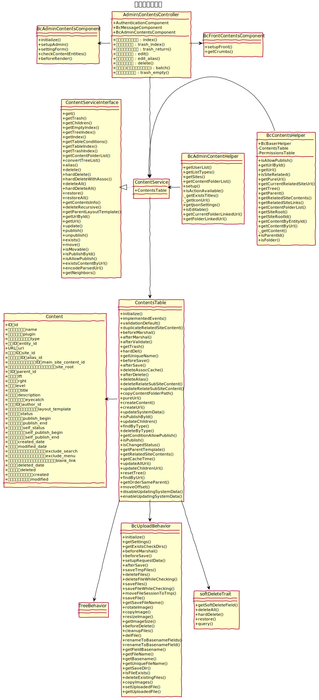

# コンテンツ設計書

## ユースケース図

## 前提条件
- コンテンツフォルダの操作は管理者しかできない。
 
## 機能

### ツリー形式で一覧を表示
既存のコンテンツをツリー形式で表示する。
また、次のアクションを提供する。
- ツリーを全て展開
- ツリーを全て閉じる
- コンテンツを作成する
- コンテンツのエイリアスを作成する
- コンテンツを並び替える
- コンテンツを公開する
- コンテンツを非公開にする
- コンテンツを確認する
- コンテンツをコピーする
- コンテンツ編集する
- コンテンツ削除する

### 表形式で一覧を表示
既存のコンテンツを表形式で表示する。
また、次のアクションを提供する。
- コンテンツを公開する
- コンテンツを非公開にする
- コンテンツを確認する
- コンテンツをコピーする
- コンテンツ編集する
- コンテンツ削除する
- コンテンツを検索する
- コンテンツの一括処理を行う

### ツリーを全て展開
ツリー形式表示においてフォルダを全て開いて表示する。

### ツリーを全て閉じる
ツリー形式表示においてフォルダを全て閉じる。

### コンテンツを作成する
コンテンツとして、フォルダ、固定ページ、もしくはプラグイン提供のコンテンツを作成する。  
作成対象のコンテンツは、`Configure` の `BcContents.items` にて定義されたものとする。  

作成時には、作成場所として指定するフォルダの右側の３点ポッチ（・・・）をクリックするか、
右クリックしてメニューを表示し、作成対象のコンテンツタイプを選択するとタイトルイトルの入力欄が表示されるので、
タイトルを入力して作成を完了する。

なお、入力したタイトルはURLにも利用されるので、URLを変更する場合は、編集画面より変更する。

### コンテンツのエイリアスを作成する
エイリアスは、指定したコンテンツを違うURLとして利用するための機能とする。  
対象コンテンツよりメニューを表示し、エイリアスを選択する事で作成する事ができる。

エイリアスは配置場所を変更する事ができ、URLとタイトルを変更する事ができる。

### コンテンツを並び替える
コンテンツの配置場所や並び順を変更する事ができる。同フォルダ内、同階層で並べ替えた場合は、
フロントエンド側におけるメニューの並び替えに影響する。

### コンテンツの名称を変更する
ツリー形式表示において、一覧上で、コンテンツのタイトルを変更する事ができる。

### コンテンツを公開する
コンテンツをフロントエンドにて公開状態に設定する事ができる。

### コンテンツを非公開にする
コンテンツをフロントエンドにて非公開状態に設定する事ができる。

### コンテンツを確認する
コンテンツのフロントエンド上の表示を確認する事ができる。
対象コンテンツのフロントエンドURLを別タブで表示する。

### コンテンツをコピーする
対象コンテンツを複製する事ができる。

### コンテンツ編集する
対象コンテンツの編集画面に遷移する。

### コンテンツ削除する
対象コンテンツをゴミ箱に移動する。

### コンテンツを検索する
表形式表示の一覧にて、フォルダ、名称、タイプ、公開状態、作成者 を指定して絞り込む事ができる。

### コンテンツの一括処理を行う
表形式表示の一覧にて、複数のコンテンツを対象として一括処理を行う事ができる。
- 公開
- 非公開
- 削除

### 関連コンテンツとしてコピーを作成する
対象コンテンツの編集画面内にて、別サイトの同階層に複製を作成する事ができる。

### 関連コンテンツとしてエイリアスを作成する
対象コンテンツの編集画面内にて、別サイトの同階層にエイリアスを作成する事ができる。

### ゴミ箱を表示する
削除したコンテンツの一覧を表示する。

### ゴミ箱から元に戻す
削除したコンテンツを未削除のコンテンツ一覧に戻す。戻す際は削除元のサイトの最上位階層に配置する。

### ゴミ箱を空にする
削除したコンテンツを全て完全に削除する。

 
## ドメインモデル図
### コンテンツ管理

 
## シーケンス図
### コンテンツフォルダ編集

 
## クラス図
### コンテンツ管理

 
### コンテンツ管理API

 
### コンテンツフォルダ管理

 
### コンテンツフォルダ管理API

 
## 特性
- [コンテンツマネージャーAPI](./contents_manager_api.md)
- [論理削除機能](./soft_delete)
- [ツリー構造機能](https://book.cakephp.org/4/ja/orm/behaviors/tree.html)
- [コンテンツ管理用ビヘイビア](./bc_contents_behavior)
- [コンテンツ管理用コンポーネント](./bc_contents_component)

