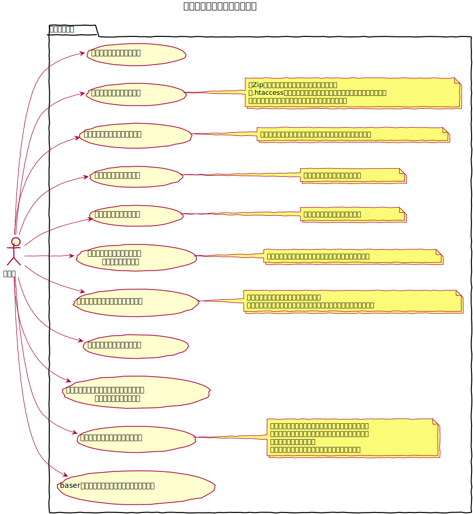

# プラグイン設計書

プラグインを管理する。

## ユースケース図


 
## 機能

一覧、新規登録、インストール、無効化、有効化、削除などの機能を提供する。

### 一覧
`/plugins/` フォルダに配置されているプラグインの一覧を表示する。
  
CakePHP4系では、テーマもプラグインとして開発するため、`config.php` にて、`type` を `Theme` と定義しているものは表示しない。
また、Configure にて、 `BcApp.core` に定義されているものは、baserCMS本体のパッケージとみなし、こちらもの表示しない。

なお、アクションとして次の機能を提供する。
- インストール（画面へ遷移）
- アップデート（画面へ遷移）
- 有効化（画面へ遷移）
- 無効化（無効化後は一覧に遷移）
- 削除（削除後は一覧に遷移）
 
### 新規登録
Zipファイルのプラグインをアップロードすることができる。  
アップロードとZipファイルの展開のみを行い、インストールは行わない。

### インストール
データベースのマイグレーションとスクリプトの実行を行う。  
インストール時、 `/VERSION.txt` 内１行目のバージョン番号をデータベースに登録する。  

#### 利用権限設定
また、インストール時に「全てのユーザーで利用」と「管理ユーザーのみ利用」が選択ができる。  
「全てユーザーで利用」を選択した場合は、アクセス制限設定に対象プラグインを追加する。

#### スクリプト実行
`/config/init.php` を配置すると、インストール時に実行させる事ができる。

### 無効化
プラグインのファイルは残り、データベースのデータも残った状態となる。

### プラグインのデータを初期化
プラグインの有効化の際、データベースのデータを初期化することができる。

### 一括無効化
プラグインのうち選択したものを一度に無効化できる。

### 並べ替え
プラグインからイベントにイベントリスナーを設定している際の実行順序を変更することができる。

### アップデート
プラグインのアップデートを実行することができる。  
`/VERSION.txt` 内のバージョン番号が、データベースに保管されたバージョン番号よりも大きい場合に、一覧にアップデートボタンを表示する。  
アップデート時には、マイグレーションの実行とスクリプトの実行を行う。

#### 対象バージョン用プログラム設置フォルダ
`/config/update/` 内にバージョン番号のフォルダを配置すると、対象バージョン用のプログラムとして認識される。

```shell
# バージョン 5.0.0 の場合
/config/update/5.0.0/
```

#### アラートメッセージ表示
対象バージョン用プログラム設置フォルダに `config.php` を配置することでアップデート画面に表示するアラートメッセージを定義することができる。

```php
// /config/update/5.0.0/config.php
<?php
return [
    'updateMessage' => 'アラートメッセージを記述します。'
];
```

#### アップデートスクリプト
対象バージョン用プログラム設置フォルダに `updater.php` を配置することで、アップデート時に実行するスクリプトを定義することができる。
```php
// /config/update/5.0.0/updater.php
<?php
// 例）
$users = TableRegistry::getTableLocator()->get('BaserCore.Users');
$user = $users->find()->where(['id' => 1])->first();
$user->name = 'hoge';
$users->save($user);
```
### baserマーケット
baserマーケットのプラグインを表示する。

 
## ドメインモデル図
### プラグイン管理


 
## クラス図
### プラグイン管理


 
### プラグイン管理API

