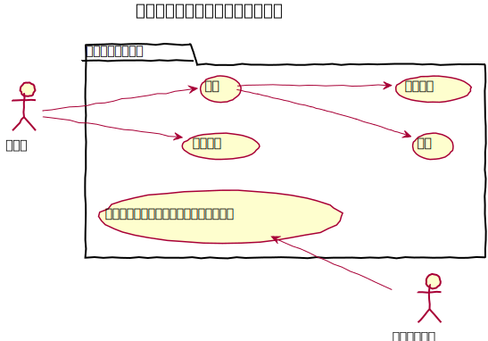
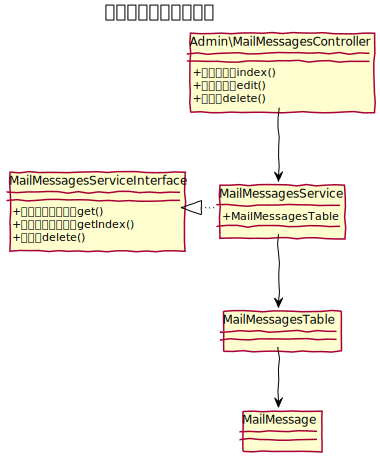
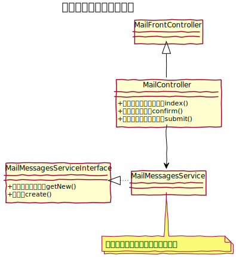

# メールメッセージ設計書

メールフォームから送信されたデータを保存し管理を行う。  

## ユースケース図

 
## 機能

### 管理機能
#### 一覧表示
メールフォームより送信されたメッセージの一覧を表示する

#### 削除
メールメッセージを削除する。

#### 一括処理
次の一括処理を提供する。
- 一括削除

### フロント機能
#### 送信メール保存
メールフォームより送信されたデータを保存する。

 
## ドメインモデル図

 
## クラス図
### 管理画面

 
### フロント

 
### API

