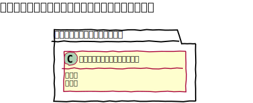

# アップローダープラグイン設定設計書

## ユースケース図

## 機能
### 編集
既存のアップローダープラグイン設定を編集する。
- **画像サイズ**: PC3種とスマホ2種のサイズを登録することができる。
- **レイアウトタイプ**: アップロードファイル一覧の表示レイアウトを切り替える事ができる。
- **制限設定**: 管理者以外のユーザーが、自分がアップロードしたファイル以外、編集・削除をできないように設定する事ができる。

 
## ドメインモデル図

 
## クラス図
### 管理画面

### API
 

