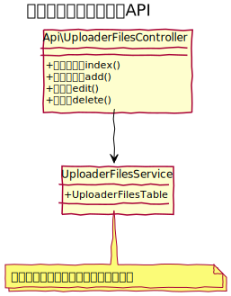

# アップロードファイル設計書

## ユースケース図

## 機能
### 管理機能
#### 一覧
アップロードファイルの一覧を表示する。ページネーションを実装する。  
カテゴリで絞り込むことができる。
#### 新規作成
新しいアップロードファイルを作成する。
#### 編集
既存のアップロードファイルを編集する。
#### 削除
既存のアップロードファイルを削除する。
### フロント
#### ファイル表示
画像ファイルの場合は img タグとして表示し、それ以外の場合はファイルへのリンクを表示する。  
公開期間を設定している場合は、その期間内だけ表示する。

## ドメインモデル図

 
## クラス図
### 管理画面

### API
 

