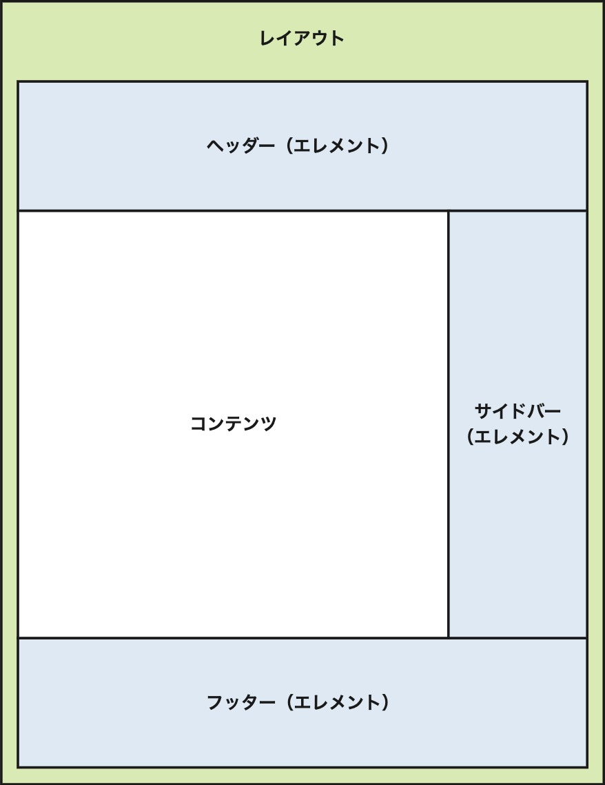

# 独自のテーマを作成する

チュートリアルを通じて、baserCMSが提供する機能に触れながら新しくテーマを作成しましょう。

## 基礎知識

テーマの作成には、基礎的なHTML、CSS、そして、少しのPHPの知識を要します。

### テンプレートの構成

<p style="text-align:center">
    
</p>

baserCMSのテンプレートは上の図のように構成されています。

- [レイアウト](glossary#レイアウトテンプレート)
    - Webページの全体を構成するテンプレートです
    - エレメントやコンテンツを配置します
- [エレメント](glossary#エレメントテンプレート)
    - 繰り返し利用される部品となるテンプレートです
    - ヘッダーやフッターなどに利用します
- [コンテンツ](glossary#コンテンツテンプレート)
    - CMSで管理しているコンテンツが出力されるエリアです

## チュートリアルの準備

まずは、baserCMSをインストールし、テーマの制作を開始できる状態にしてください。

- [インストールガイド](../introduce/)

## テーマフォルダの作成

`/plugins` ディレクトリに任意の名前のフォルダを作成します。
ここでは「CorpTheme」というテーマ名で進めます。
チュートリアルではこのフォルダを「テーマフォルダ」と呼びます。

```shell
{baserCMSの設置フォルダ}/plugins/CorpTheme/
```

## 最小限のフォルダ・ファイルを作成する

テーマフォルダの中に以下の構成となるようにフォルダ・ファイルを作成します。  
ファイルの中身は次のセクションで書いていくので空で構いません。  
※ screenshot.pngは現時点でなくて構いません

- CorpTheme/
    - src/
        - Plugin.php
    - templates/
        - layout/
            - default.php
    - config.php
    - screenshot.png

### プラグインクラスを作成する

baserCMSでは、テーマもプラグインのひとつとして動作します。  
プラグインの動作のために必要なおまじないとして、以下の内容でプラグインクラス を作成します。

```php
<?php
// CorpTheme/src/Plugin.php
namespace CorpTheme;

use BaserCore\BcPlugin;

class Plugin extends BcPlugin{}
```

### configファイルを作成する

baserCMSのコアに、プラグインの情報を認識させるために config ファイルを作成します。
以下の内容を参考に作成します。

```php
<?php
// CorpTheme/config.php
return [
    'type' => 'Theme',
    'title' => 'コーポレートテーマ',
    'description' => 'コーポレートサイトに適したテーマです。',
    'author' => 'baserCMS User Community',
    'url' => 'https://basercms.net',
    'installMessage' => ''
];
```

- **type**: `Theme` を記載してください。そうすることでテーマ管理で認識できます。
- **title**: テーマの名前を任意で記載してください。
- **description**: テーマの詳細を記載してください。
- **author**: 制作者・企業の名前を記載してください。
- **url**: 制作者・企業のURLを記載してください。
- **installMessage**: インストール完了時にメッセージを表示したい場合に入力します。

## レイアウトテンプレートの作成
レイアウトテンプレートとは、Webページの枠組みを記述するファイルです。

全ての Webページでの共通部分を含める事でメンテナンス性を高める事ができます。
このファイルを変更するだけで、あらかじめ用意されているブログや、メールフォームのレイアウトも変更する事ができます。

以下の内容で `CorpTheme/templates/layout/default.php` を作成します。
これからこのファイルに、baserCMS用のタグ「baserタグ」を組み込んでいきます。

```php
<!DOCTYPE html>
<html>
<head>
    <title>タイトルを記述</title>
    <meta name="description" content="説明文を記述" />
    <meta name="keywords" content="キーワードを記述" />
</head>
<body>

    <header>
        ヘッダー内容を記述
    </header>

    <div id="Wrap">
        <div id="contensBody">
            コンテンツ内容を記述
        </div>
        <div id="Sidebar">
            メニュー等を記述
        </div>
    </div>

    <foolter>
        フッター内容を記述
    </foolter>

</body>
</html>
```

### baserCMSのタグを学ぶ

baserCMSでは、CMS内で管理しているコンテンツを動的に表示するために「baserタグ」を提供しています。
テーマのテンプレート上で「baserタグ」を利用することでき、次のような形で利用します。

タイトルタグを出力する例

```php
<?php $this->BcBaser->title() ?>
```

baserタグには、大きく３つの系統があります。

- **取得系**
    - コンテンツの情報などを取得します。
    - e.g. `$this->BcBaser->getTitle()`
- **出力系**
    - 情報の取得と出力を行います。
    - e.g. `$this->BcBaser->title()`
- **判定系**
    - 現在のページ情報やユーザ情報から真偽を判定します。条件分岐に利用します。
    - e.g. `$this->BcBaser->isHome()`

### baserタグを埋め込む

`CorpTheme/templates/layout/default.php` にbaserタグを埋め込んでいきます。
ファイルの中身を以下に書き換えてください。

```php
<!DOCTYPE html>
<html>
<head>
	<?php $this->BcBaser->title() ?>
	<?php $this->BcBaser->metaDescription() ?>
	<?php $this->BcBaser->metaKeywords() ?>
	<?php $this->BcBaser->scripts() ?>
</head>
<body>

    <?php $this->BcBaser->func() ?>

    <header>
        ヘッダー内容を記述
    </header>

    <div id="Wrap">
        <div id="contensBody">
			<?php $this->BcBaser->content() ?>
			<?php $this->BcBaser->contentsNavi() ?>
        </div>
        <div id="Sidebar">
            <?php $this->BcBaser->widgetArea() ?>
        </div>
    </div>

    <footer>
        フッター内容を記述
    </footer>

</body>
</html>
```

### タイトルタグ

```php
<?php $this->BcBaser->title() ?>
```

メタタグのtitleを出力します。
次のように展開されます。

```html
<title>コンテンツタイトル | カテゴリ| サイト名</title>
```

### メタディスクリプションタグ

```php
<?php $this->BcBaser->metaDescription() ?>
```

ページ説明文用のメタタグを出力します。
次のように展開されます。

```html

<meta name="description" content="baserCMS は、CakePHPを利用し、環境準備の素早さに重点を置いた基本開発支援プロジェクトです。WEBサイトに最低限必要となるプラグイン、そしてそのプラグインを組み込みやすい管理画面、認証付きのメンバーマイページを最初から装備しています。">
```

### メタキーワードタグ

```php
<?php $this->BcBaser->metaKeywords() ?>
```

キーワードメタタグを出力します。
次のように展開されます。

```html

<meta name="keywords" content="baser,CMS,コンテンツマネジメントシステム,開発支援">
```

### scripts タグ

閉じヘッダータグの直前に配置します。コンテンツ内で定義したスクリプトやCSS、ツールバー表示用のスクリプトやCSS、そして、管理システムのシステム基本設定で設定したヘッダー埋め込みスクリプトなどを出力します。おまじないと思ってください。

```php
<?php $this->BcBaser->scripts() ?>
```

### func タグ

ツールバー用のHTMLや、管理システムのシステム基本設定で設定したフッター埋め込みスクリプト等を出力します。こちらもおまじないと思ってください。

なお、ツールバーを表示するには、scripts タグと func タグの両方の定義が必要です。

```php
<?php $this->BcBaser->func() ?>
```

### コンテンツタグ

CMSで登録したコンテンツデータを出力します。

```php
<?php $this->BcBaser->content() ?>
```

### コンテンツナビゲーションタグ

ページの前後ナビゲーションを出力します。

```php
<?php $this->BcBaser->contentsNavi() ?>
```

### ウィジェットエリアタグ

管理システムで設定したウィジェットエリアを出力します。

```php
<?php $this->BcBaser->widgetArea() ?>
```

### その他

baserCMSでは、他にも多数のbaserタグを提供しています。
是非、[関数リファレンス](reference/)を御覧ください。

## 共通部品を利用する

これまででbaserタグを利用して、動的に変化する文章などを表示することができました。

ヘッダーやフッターのように、別のレイアウトテンプレートからも同じテンプレートを共通で利用するケースがあります。
baserCMSでは、エレメントと呼ばれる共通部品を作成・利用できる機能を提供しています。

`CorpTheme/templates/` に `element` フォルダを作成し、その中に `header.php` と `footer.php` を作成します。

- CorpTheme/
    - src/
      - Plugin.php
    - templates/
        - element/
            - **header.php**
            - **footer.php**
        - layout/
            - default.php
    - config.php
    - screenshot.png

### ヘッダーファイルを作成する

次の内容でヘッダーファイルを作成します。

```php
// CorpTheme/templates/element/header.php
<header>
    <ul>
        <li><a href="/">トップページ</a></li>
    </ul>
</header>
```

### フッターファイルを作成する

次の内容でフッターファイルを作成します。

```php
// CorpTheme/templates/element/footer.php
<footer>
    <p> Copyright(C)
        <?php $this->BcBaser->copyYear(2022) ?>
        baserCMS Users Community All rights Reserved.
    </p>
</footer>
```

`$this->BcBaser->copyYear()` はコピーライト用の年を出力するbaserタグです。  
開始年を指定すると `2022 - 2023` のように出力されます。

### エレメントを埋め込む

レイアウトにbaserタグを使ってエレメントを埋め込みます。

ファイルの中身を以下に書き換えてください。

```php
// CorpTheme/templates/layout/default.php
<!DOCTYPE html>
<html>
<head>
    <?php $this->BcBaser->title() ?>
    <?php $this->BcBaser->metaDescription() ?>
    <?php $this->BcBaser->metaKeywords() ?>
</head>
<body>

    <?php $this->BcBaser->func() ?>

    <?php $this->BcBaser->header() ?>

    <div id="Wrap">
        <div id="contensBody">
            <?php $this->BcBaser->content() ?>
            <?php $this->BcBaser->contentsNavi() ?>
        </div>
        <div id="Sidebar">
            <?php $this->BcBaser->widgetArea() ?>
        </div>
    </div>

    <?php $this->BcBaser->footer() ?>

</body>
</html>
```

### ヘッダータグ

ヘッダータグは、エレメントフォルダ内の `header.php` を読み込みます。

```php
<?php $this->BcBaser->header() ?>
```

### フッタータグ

フッタータグは、エレメントフォルダ内の `footer.php` を読み込みます。

```php
<?php $this->BcBaser->footer() ?>
```

### その他のエレメント

その他のエレメントを作成し、読み込む場合は、`element` 関数を利用します。

次の場合、`Corptheme/templates/element/sidebar.php` を読み込みます。

```php
$this->BcBaser->element('sidebar')
```

## テーマを有効化する

これまで作成してきたテーマを確認しましょう。

baserCMSの管理画面にログインし、`テーマ管理` を選択すると、サンプルテーマの他に今回作成した「コーポレートテーマ（CorpTheme）」が表示されています。

対象テーマ下部のチェックボタンをクリックすると、「テーマを適用します。よろしいですか？」とポップアップで表示されるので「OK」をクリックします。

テーマが適用されると、「現在のテーマ」が「コーポレートテーマ（CorpTheme）」に変わっていることが確認できます。

管理画面左上の「サイト表示」をクリックし、フロントページを確認します。

CSSの適用されていない画面が表示されていますか？そうであれば作成したテーマに切り替わっています。

あとは、好みに応じて、CSSなどを配置して適用します。


## アセットファイルを配置する

CSSや画像、JavaScript等のアセットファイルは、テーマフォルダの `webroot` フォルダ配下に配置します。

- CorpTheme/
    - webroot/
        - **img/**
        - **css/**
        - **js/**

これらは次のように呼び出すことができます。  

```php
<?php $this->BcBaser->css('example.css') ?>
<?php $this->BcBaser->js('example.js') ?>
<?php $this->BcBaser->img('example.png') ?>
```

## 静的HTMLを配置する

HTMLなどの静的なファイルは、ドキュメントルート直下の `webroot` フォルダに配置します。

例えば `test.html` ファイルを `webroot` フォルダに配置します。

```shell
/webroot/test.html
```

次のURLで参照することができます。

```shell
https://your-domain/test.html
```

チュートリアルはこれで終了です。お疲れさまでした！


## 作ったテーマを配布・販売する

作ったテーマは baserマーケットで配布・販売することができます。  
詳しくは [プラグイン・テーマを配布・販売する](/5/developer/market/sell) をご覧ください。

## テーマについてもっと詳しく知る

- [用語集](glossary)
- [テーマのフォルダ構造](folder)
- [ファイル読み込みの優先順位](file_priority)
- [テンプレートのカスタマイズ](customizing_template)
- [関数リファレンス](reference/index)
