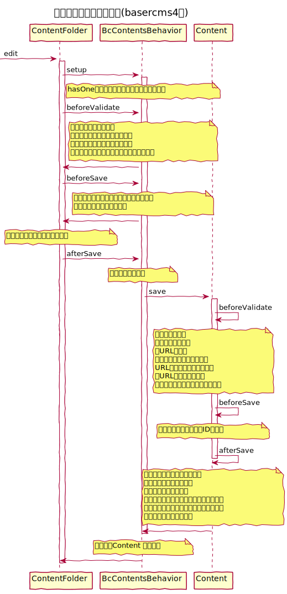

## BcContentsBehaviorとは

コンテンツフォルダーなどのモデルをコンテンツのモデルとして紐付け使用するためのもの

## 関連
  - [コンテンツ管理](./index)
  - [コンテンツフォルダ管理](../content_folders/index)
  - [ページ管理](../pages/index)
  - [リンク管理(ページ未完成)]()
  - [メールコンテンツ管理(ページ未完成)]()

### basercms4→ucmitz変更点

beforeValidateでバリデーションのマージ、beforeSaveでエラーがある場合処理の中断をしていた箇所をucmitzではbeforeMarshalの一箇所で対応
### シーケンス図(例:ContentFolder)

#### 編集処理

#### 作成処理

#### 削除処理