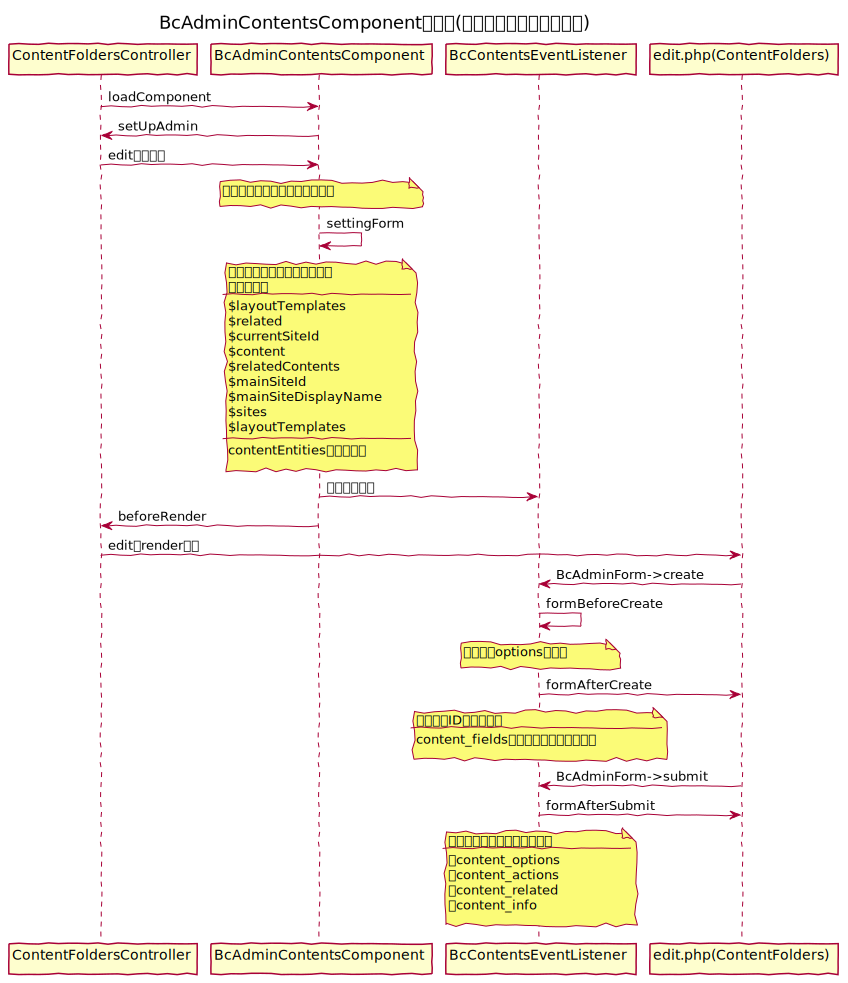

## コンテンツ管理用コンポーネントについて

### basercms4系とucmitzの違い

4系ではBcContentsComponentだったクラスを<b>管理画面用(BcAdminContentsComponent)</b>と<b>フロント画面用(BcFrontContentsComponent)</b>に分離してます

#### <b>BcAdminContentsComponent</b>

Admin/ContentFoldersController.php・Admin/ContentsController.phpなどの管理画面で使用

#### 役割

- コンテンツアイテムの読み込み
- 管理画面で使用する変数を設定
- イベント設置(<u>BcContentsEventListener</u>)
  - ※ <u>BcContentsEventListener</u>では、フォーム画面に他のエレメントを結合するなど追加処理がある

### シーケンス図(例:ContentFolder)

#### 編集処理

#### <b>BcFrontContentsComponent</b>

Controller/PagesController.phpなどフロント画面で使用

#### 役割

<b>以下作成途中です...</b>
