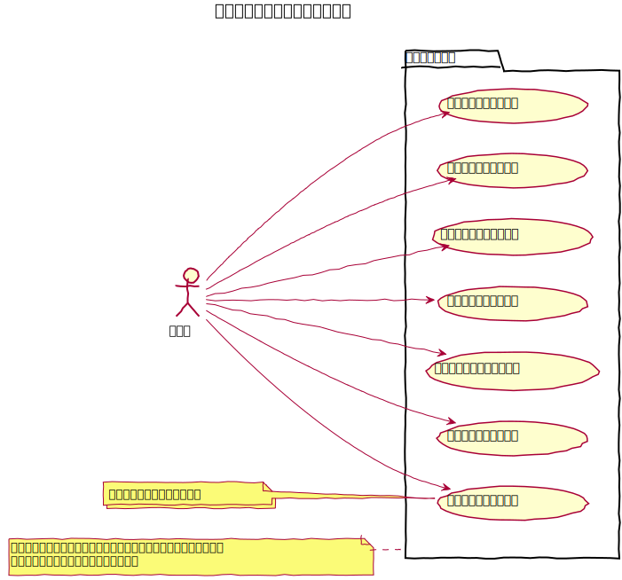
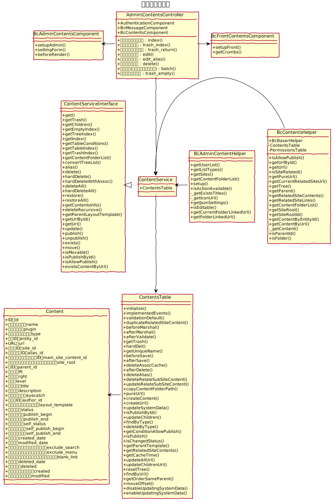
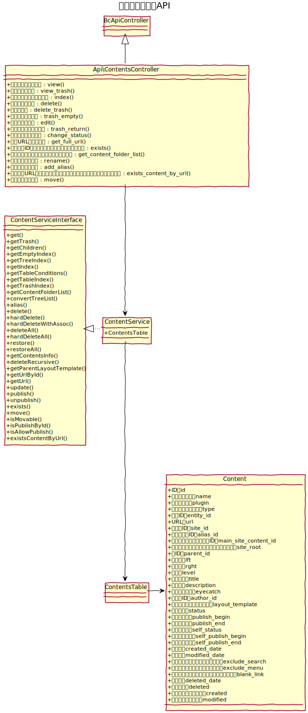

# コンテンツ設計書

## 特性
  - [softDelete機能](./softDelete)
  - [アップロード機能](../common/upload)
  - [ツリー構造機能](https://book.cakephp.org/4/ja/orm/behaviors/tree.html)

## 関連(BcContentsBehavior)
  - [コンテンツフォルダ管理](../content_folders/index)
  - [ページ管理](../pages/index)
  - [リンク管理(ページ未完成)]()
  - [メールコンテンツ管理(ページ未完成)]()
## ユースケース図

## クラス図

