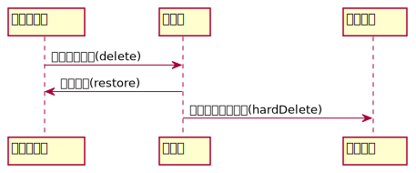

## コンテンツ管理におけるsoftDelete


basercms4系ではsoftDeleteBehaviorを使っていたが、ucmitzではsoftDeleteTraitに変更

cakphp2ではdeleted、deleted_dateカラムを設定して削除時にdeletedに削除フラグ、deleted_dateに削除日時がセットされていた
↓
ucmitzでは\$softDeleteFieldに指定したフィールドを元に論理削除か物理削除かを判別に変更(※deletedフィールドは削除)


#### コンテンツ作成後のsoftDeleteの挙動



#### SoftDeleteTraitを使用した際の削除

```php
use SoftDeleteTrait;
protected $softDeleteField = 'deleted_date';
// 論理削除により、delete_dateフィールドに削除時の時間が入る
$this->delete($content);
// 完全に削除
$this->hardDelete($content);
```

#### 論理削除されたコンテンツの復元

```php
$this->delete($content);
// 論理削除を復元
$this->restore($content);
```

#### 論理削除されたものをコンテンツ・サービス経由で取得する

```php
// idが１のコンテンツを論理削除した場合
$content = $this->ContentService->get(1);
$this->delete($content);
// getTrashで論理削除された要素を取得できる(getメソッドだとエラー発生)
$content = $this->ContentService->getTrash(1);
// 同様にゴミ箱内のリストを取得する場合
$contents = $this->ContentService->getTrashIndex();
```

#### コンテンツの存在確認

```php
// 論理削除を含めない場合
if ($this->ContentService->exists($id)) {...}
// 論理削除を含める場合
if ($this->ContentService->exists($id, true)) {...}
```

#### softDeleteした物をクエリ結果に含める場合

```php
$query = $this->find();
// withDeletedオプションの適応でクエリに論理削除した物も含める
$query = $query->applyOptions(['withDeleted']);
// ContentServiceの場合['withTrash' => true]で上記と同じ処理になる
$query = $this->ContentService->getIndex(['withTrash' => true]);
```

### 既存コードでの論理削除比較

```php
// basercms4
if (empty($content['Content']['alias_id'])) {
	// エイリアス以外の場合
	$result = $this->delete($id);
} else {
	// エイリアスの場合、直接削除
    // softDelete(null), softDelete(false)でBehaviorをオフにして物理削除
	$this->softDelete(null);
	$this->softDelete(false);
	$result = $this->delete($content['Content']['id']);
}
// ucmitz
if (!$content->alias_id) {
	$result = $this->delete($content);
} else {
	// エイリアスの場合、直接削除
    // hardDeleteで物理削除
    $result = $this->hardDelete($content);
}
```
