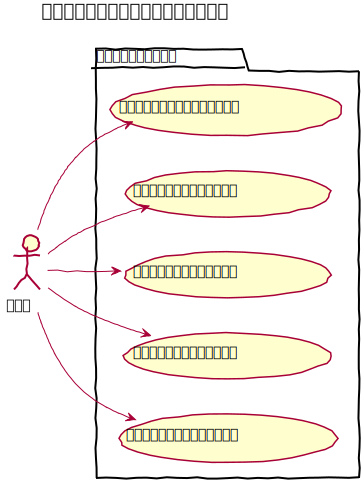
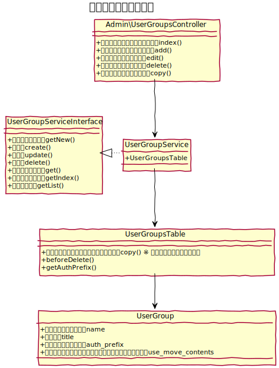

# ユーザーグループ設計書

ユーザーを取りまとめるユーザーグループを管理する。

　
## 機能
### 管理機能
一覧、新規登録、編集、削除、コピーの機能を提供する。  
コピーを実行する際は、ユーザーグループに紐づくアクセス制限設定も一緒にコピーする。  
また、`admins` グループは特別なグループとして、ユーザーグループ名の変更、削除、および、アクセス制限の設定はできない。

### 認証プレフィックス
baserCMSでは、認証プレフィックスの設定により、管理画面以外の認証領域を作成できるが、ユーザーグループごとにどの領域に対してログイン可能かを設定できる機能。
　
## ユースケース図

　
## ドメインモデル図

　
## クラス図

