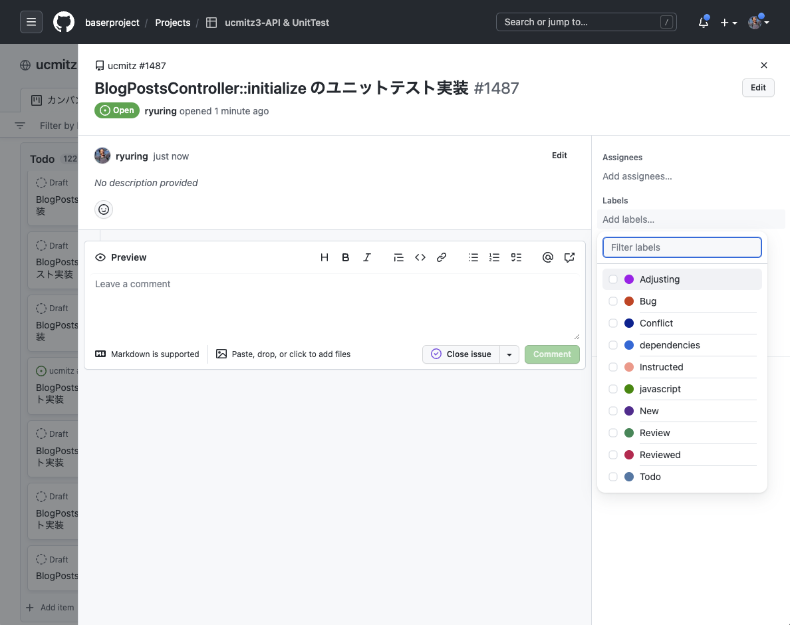

# GitHub Projects の利用方法

## プロジェクトの種類
現在、GitHub の Issue を GitHub Projects を利用して４つのプロジェクトに分類しつつ管理しています。

### ucmitz3-既存機能移行
baserCMSの既存機能の移行に関するIssue
### ucmitz3-API & UnitTest
既存機能の移行に際して発生したユニットテストとAPI開発のためのIssue
### ucmitz4
baserCMS５の新機能のIssue
### ucmitz ML検討中
上記に当てはまらず、マイルストーンが決定していないIssue

　
## Issueの作成
GitHub Projects で Issueを作成すると、どのレポジトリにも紐付いていない、「draft」という状態になります。この時点では、プルリクエストとは紐付ける事ができません。

新しいIssue は、まず、draft として作成しておきます。  
そして、「どうするか」が決定したら、レポジトリに紐付いた Issueに変換します。

### Issue への変換

1. draft のタイトルをクリックして詳細画面を開きます。

2. 「Convert to issue」 をクリックします。

3. 「ucmitz」をクリックします。そうすると Issue に変換されます。

4. 状態が「open」なりますので、その次に、「Add milestone」をクリックし、マイルストーンを選択します。

5. 「Add Labels」をクリックし、ラベルを選択します。

6. 説明欄に指示や作業内容を入力します。

　
## ucmitz3-API & UnitTest
このプロジェクトでは、主に、新しく作成したメソッドや、既存メソッドで動作確認済（@checked）、残作業なし（@noTodo）となっているもののユニットテストの Issue を管理します。

Issue には、ユニットテストが実装できるようにするため、説明欄に指示を書く事を前提とします。
作業担当者は、「Instructed」ラベルのついた Issue より作業に取り掛かります。

現在、ユニットテストの指示について、メソッドのヘッダーコメントに仕様の詳細を記述した上で、それを確認する事を指示としています。

Issue 変換時には、メソッドのヘッダーコメントを見直した上で、Issueには、次を設定してください。

- マイルストーン：3.0.0
- ラベル：Instructed
- 説明欄：メソッドのヘッダーコメントを確認する

　

