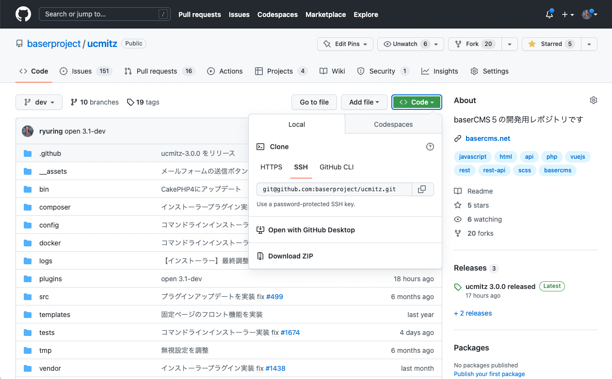
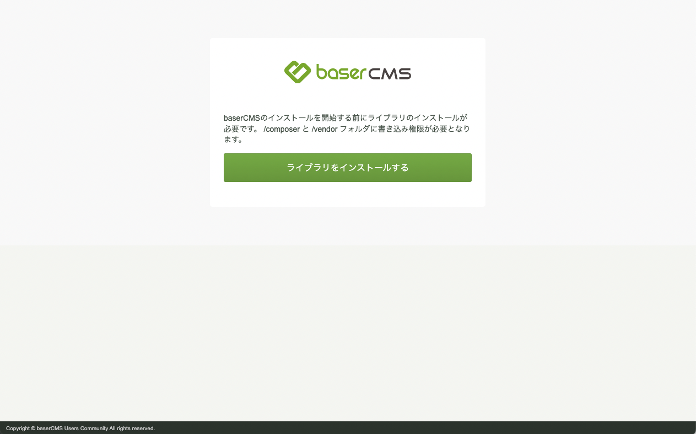
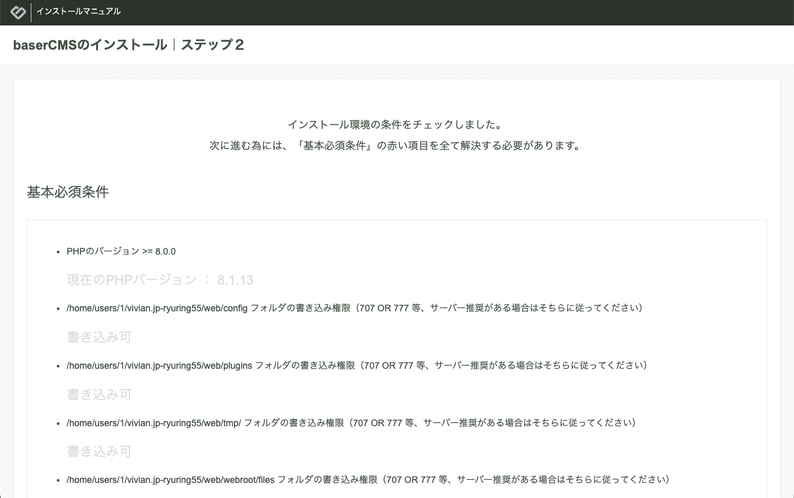
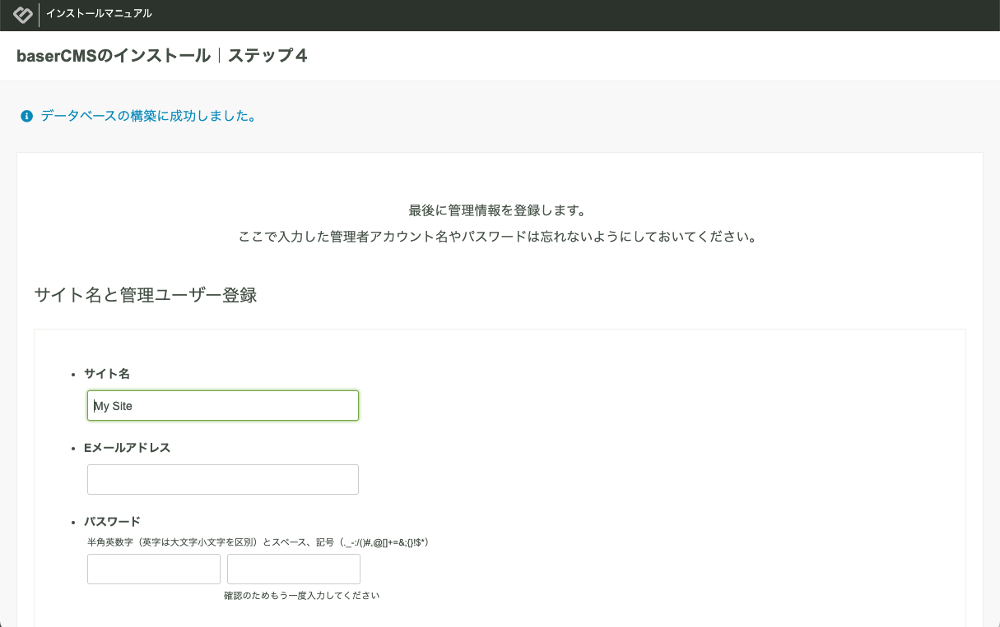

# baserCMS５インストール手順

baserCMS５のインストールはインストーラーを利用する事で簡単に進めることができます。

## パッケージの配置

baserCMSが提供する Docker を利用する場合は、必要ありませんが、それ以外のサーバーを利用する場合は、GitHubより、git でクローンするか、Zipファイルでダウンロードし、FTPで転送します。

[baserCMS開発版レポジトリ（ucmitz）](https://github.com/baserproject/ucmitz)



baserCMSが提供する Docker を利用する場合は、[開発環境の構築](./environment) を参照してください。

　
## インストーラーを起動

パッケージの配置が終わったら、配置先のURLにブラウザでアクセスするとインストーラーが起動します。



　
## ライブラリのインストール

「ライブラリをインストールする」ボタンをクリックして、baserCMS５に必要なライブラリをインストールします。  
内部的には、composer を利用して、CakePHP4などをインストールしています。  
composer を利用するには、CLI版のPHPが必要となりますが、PHPのパスが取得できない場合があります。  
インストーラー画面の「PHPのパス」が空の状態になっている場合は、パスを調べてから手動で入力する必要があります。

例えば、2023/2/22 現在のロリポップでは、次のパスとなります。

```shell
/usr/local/php/8.1/bin/php
```


インストールが完了すると、baserCMS５のインストール画面に切り替わります。


　
### ライブラリのインストールがうまくいかない場合
PHPのパスを入力してもインストールがうまくいかない場合は、SSHでログインして手動で次のコマンドを実行してください。

```shell
# インストールしたディレクトリに移動した上で
# PHPのパスを通した上で
curl -sS https://getcomposer.org/installer | php
./composer.phar self-update
./composer.phar install
cp config/.env.example config/.env
```
上記コマンド完了後に、配置先のURLに再度アクセスすると、baserCMS５のインストール画面が表示されます。

　
## 環境チェック
「インストール開始」ボタンをクリックすると、環境チェックが始まります。  
「基本必須条件」に赤色の文字が出てなければインストール可能な状態ですので、「次のステップへ」をクリックします。  
そうでない場合、画面の指示に従い設定を行い、「再チェック」をクリックします。



　
## データベース設定
データベースは、MySQL、PostgreSQL、SQLite を提供予定ですが、現在（2022/12/22）は、MySQLのみ対応している状況です。
次の情報を入力し、「接続テスト」ボタンをクリックします。

- データベースホスト名
- ユーザー名
- パスワード
- データベース名

※ 現在、プレフィックスは未対応です。ご注意ください。

baserCMSが提供する Docker を利用している場合は、データベース情報について、[開発環境の構築](./environment) を参照してください。


接続に成功したら、「次のステップへ」をクリックします。  
このタイミングでデータベースの構築が始まりますので少し時間がかかります。　

　
## サイト名と管理ユーザー登録
サイト名と管理ユーザーの情報を入力して「登録」ボタンをクリックします。  
最後のセットアップが始まりますので少し時間がかかります。



　
## インストール完了
インストール完了です。お疲れさまでした。


トップページは管理画面を開いて正常に動作しているか確認しましょう。

アプリケーションの管理画面は、SSLでアクセスしないとエラーとなります。  
http でアクセスしたい場合は、`/config/.env` の `ADMIN_SSL` を false  に設定してください。

　
## その他の注意事項
フロントエンド側は、現時点（2022/12/22）にて次の点が未実装ですのでご了承ください。
- 初期のブログ画像が表示されていない
- アクセスマップが表示されていない
- トップページのブログ記事一覧が表示されていない

　
　
　
