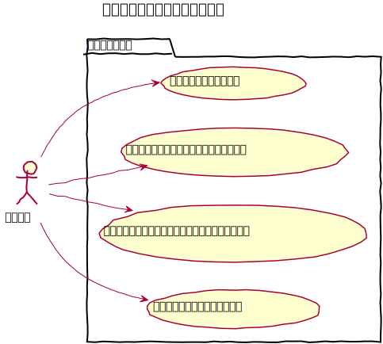
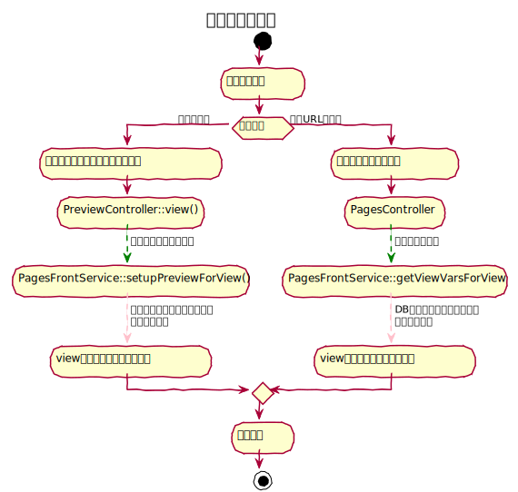

# プレビュー機能設計書

記事を公開する前に表示を確認する事ができる機能。管理画面にログインしている事が前提となる。

　
## ユースケース


　
## 機能
### 通常プレビュー
GETでURLを参照する事により、保存済みのDBデータを参照して未公開の記事を確認する事ができる。

### 保存前プレビュー
現在、編集中の内容をPOST送信すると、そのデータを利用して記事を確認する事ができる。

### 下書きプレビュー
現在、編集中の下書きの内容をPOST送信し、そのデータを利用して記事を確認することができる。


### エイリアスプレビュー
エイリアス元の未公開の記事を確認する事ができる。

　
## プレビューモードについて
プレビュー実行時にはURLのクエリストリングに `preview` を入れる必要があり、初期状態では、`default` となっている。
プレビューモードは、コンテンツごとに定義する事ができ、モードによって、プレビュー実行時の処理内容を振り分ける事に利用できる。

```shell
# URL例：default モード
https://localhost/baser/admin/baser-core/preview/view?
    url=https://localhost/service/service1&
    preview=default
    
# URL例：draft モード
https://localhost/baser/admin/baser-core/preview/view?
    url=https://localhost/service/service1&
    preview=draft
    
# URL例：alias モード
https://localhost/baser/admin/baser-core/preview/view?
    url=https://localhost/service/service1&
    preview=alias
```

　
## 草稿プレビュー
### プレビューモードの取得
CKEditorを利用する場合、本稿モード、草稿モードの切り替えに応じて `<hidden id="ContentPreviewMode" />` にプレビューモードが設定される。（default or draft）
 
上記 hidden タグの id は、 `$this->BcAdminForm->ckeditor()` のオプション、`editorPreviewModeId` で変更が可能となっており、複数フィールド配置する場合に、id を変更して対応する。

### データの取得
`$request->getQuery('preview')` でモードを取得し、モードに応じて表示に利用するデータを切り替えます。

```php
// 例
$postArray = $request->getData();
if ($request->getQuery('preview') === 'draft') {
    $postArray['detail'] = $postArray['detail_draft'];
}
```

　
## PreviewController について
プレビュー時に実行する `PreviewController` は、次の処理を行う。

1. クエリストリング `url` をルーティングにより解析してコントローラーとアクション決定
2. コンテンツが提供するサービスクラスのメソッドを呼び出す
3. コンテンツに紐付いたテンプレートを呼び出す

### サービスクラスの呼び出し
ルーティングにより決定したコントローラーとアクションによって、サービスクラスの呼び出しとメソッドの実行を行う。  
サービスクラスとメソッドは次の命名規則に則ったものが存在すれば実行し、なければ何もしない。

```shell
# サービスクラスとアクション名
{ControllerName}FrontService::setupPreviewFor{ActionName}()

# 例）PagesController の view アクション場合
PagesFrontService::setupPreviewForView()

# その場合のテンプレート
templates/Pages/view.php
```

### アクション内（setupPreviewForXXX）での処理
このメソッドでは引数としてコントローラーを受け取るので、テンプレートの値のセットや、テンプレートの変更などを行うことができる。  
また、$controller->getRequest() では、プレビュー対象のURLに基づいたリクエスト情報を受け取る事ができる。

```php
// 例）
class PagesFrontService
{
    public function setupPreviewForView(Controller $controller)
    {
        $request = $controller->getRequest();
        $content = $request->getAttributes('currentContent');
        // DBのデータを取得
        $page = $this->get($content->entity_id);
        // POSTデータによって書き換える
        $page = $this->Pages->patchEntity($page, $request->getData);
        // Viewにセット
        $controller->set([
            'page' => $page
        ]);
        // テンプレートの変更
        $controller->viewBuilder()->setTemplate('etc');
    }
}
```

　
## コンテンツ管理におけるプレビューの実装
コンテンツ管理にて管理するコンテンツを開発する場合、`BcAdminContentsComponent` をロードする事で、保存ボタンの左に自動でプレビューボタンを自動配置する仕様となっています。

その際、プレビューボタンをクリックした場合の遷移先は、`PreviewController` を利用するURLになっています。

### プレビューモード

Dom の id `ContentPreviewMode` の hidden タグの value 値をプレビューモードとして送信する仕様となっていますので、変更する場合は、Javascript等で送信前に切り替えておきます。 

```javascript
// JQueryの場合
$("#ContentPreviewMode").val('draft');
```

### 非公開記事の閲覧条件
管理画面でログイン状態である、かつ、クエリストリング `preview` に何かしらの文字列が設定されていると、非公開状態のコンテンツでもルーティングが成功する仕様となっています。

　
## アクティビティ図



　
