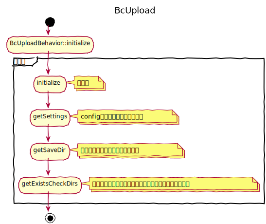
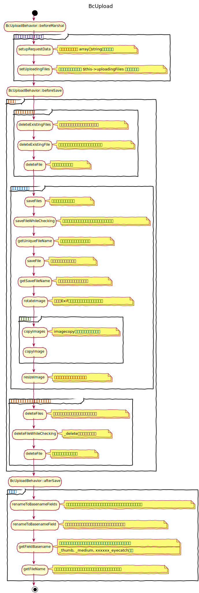
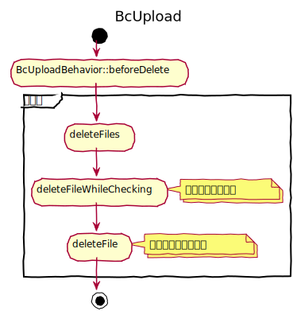
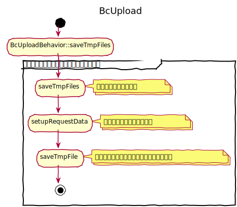
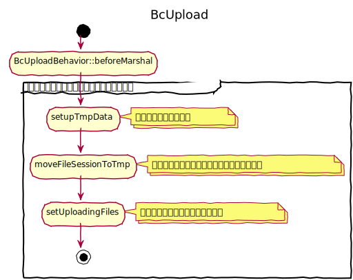

# ファイルアップロード設計書

ファイルのアップロードについては、対象となるテーブルオブジェクトにて、`BcUploadBehavior`、`BcUploadHelper` を利用し実装するものとする。

- BcUploadHelper：コントロールの設置
- BcUploadBehavior：ファイルの保存、削除、DB用データへの変換
- UploadsController：一時アップロード画像の表示

## ユースケース


　
## 実装方法
対象となるテーブルオブジェクトに `BcUploadBehavior` を追加し、設定を記述した上で、ビューにファイルアップロード用のコントロールを配置する。  
データをポストしテーブルで保存するタイミングでファイルの保存処理などを行う。

### テーブルへBehaviorを追加
```php
// 実装例
public function initialize(array $config): void
{
   $this->addBehavior('BaserCore.BcUpload', [
        // 保存フォルダ名
        'saveDir' => "editor",
        // サブフォルダフォーマット
        // 保存フォルダをサブフォルダで分類する場合に設定
        'subdirDateFormat' => 'Y/m',
        // フィールドごとの設定
        'fields' => [
            // フィールド名
            'image' => [
                // ファイルタイプ
                // all | image | ファイルの拡張子
                'type' => 'image',
                // ファイル名を変換する際に参照するフィールド
                'namefield' => 'id',
                // ファイル名を変換する場合のフォーマット
                'nameformat' => '%08d',
                // ファイル名に追加する文字列
                // 文字列 | false
                'nameadd' => false,
                // リサイズ設定
                // アップロードした本体画像をリサイズ
                'imageresize' => [
                    // 横幅
                    'width' => '100',
                    // 高さ
                    'height' => '100'
                ],
                // コピー設定
                'imagecopy' => [
                    'thumb' => [
                        'suffix' => 'template',
                        'width' => '150',
                        'height' => '150'
                    ],
                    'thumb_mobile' => [
                        'suffix' => 'template',
                        'width' => '100',
                        'height' => '100'
                    ]
                ]
            ],
            'pdf' => [
                'type' => 'pdf',
                'namefield' => 'id',
                'nameformat' => '%d',
                'nameadd' => false
            ]
        ]
    ]);
}
```

### ビューにコントロールを設置

内部的に、`BcUploadHelper` を利用する。
```php
echo $this->BcAdminForm->control("Content.eyecatch", [
    'type' => 'file', 
    'imgsize' => 'thumb'
])
```

　
## BcUploadBehaviorの設定

### ファイルの保存先
`/webroot/files/` 配下にて、設定値 `saveDir` で設定したフォルダに保存する。  
設定値 `subdirDateFormat` を定義している場合、保存日をベースとしたフォーマットでサブフォルダを作成しそこに保存する。

```php
// saveDir が contents、subdirDateFormat が Y/m の場合
/webroot/files/contents/2022/01/
```

### フィールドごとの設定
設定値 `fields` に配列で、複数のフィールドに対してファイルを保存できるように設定できる。
`fields` を設定する場合、各フィールドのキーをフィールド名とする。

### ファイルのタイプ
設定値 `type` でファイルのタイプを設定する。
- all：全てのファイル
- image：画像ファイル
- その他、ファイルの拡張子を設定する。

### ファイルのリネーム
#### フィールド値に基づいたリネーム
例えば、ID に基づいたファイル名にしたい場合、設定値 `namefield` に `id` を設定し、設定値 `nameformat` に、フォーマットを設定する。
```php
// namefield を id、nameformat を %08d と設定し、id が 52 の場合
'00000052.png'
```

#### フィールド名を追加する
設定値 `nameadd` を `true` に設定することで、ファイル名に、フィールド名を追加する。
```php
// フィールド名 eyecatch の場合
'00000052_eyecatch.png'
```

#### プレフィックス
設定値 `prefix` を設定することで、ファイル名にプレフィックスを設定する。
```php
// prefix を smartphone_ とした場合 
'smartphone_00000052_eyecatch.png'
```

#### サフィックス
設定値 `suffix` を設定することで、ファイル名にサレフィックスを設定する。
```php
// suffix を _smartphone とした場合 
'00000052_eyecatch_smartphone.png'
```

### 画像のリサイズ
画像をリサイズする場合は、設定値 `imageresize` に配列で次の内容を定義する。
- width：横幅
- height：高さ

プレフィックスやサフィックスも設定できる。

### 画像のコピー
設定値 `imagecopy` に配列で複数のコピー設定を定義できる。  
配列のキーには画像を特定する文字列を設定する。  
画像のリサイズと同様に、横幅、高さ、プレフィックス、サフィックスが定義できる。

　
## レコードの保存処理　
### ファイル保存のタイミング
対象のテーブルクラスで `save` を実行した場合、`beforeSave` のタイミングでファイルを保存する。

### 保存の流れ
- beforeMarshal
  - ポストデータを最適化し保存対象かどうか判定
- beforeSave
  - 保存対象のフィールドの古いファイルを削除
  - 保存対象のファイルを保存
  - 削除にチェックが入っているフィールドのファイルを削除
- afterSave
  - ファイルをリネーム

### ファイルの削除
保存対象のデータの中に `{フィールド名}_delete` というキーに、`true` が設定されているとファイルの削除対象となる。
このフィールドは、`BcUploadHelper` が自動的に追加する。

　
## レコードの削除処理
### ファイル削除のタイミング
対象のテーブルクラスで `delete` を実行した場合、`beforeDelete` のタイミングでファイルを削除する。

### 削除の流れ
- beforeDelete
  - 対象レコードの全てのフィールドのファイルを削除

　
## ファイルの一時保存
確認画面を作りたい場合や、プレビューを行いたい場合、ファイルをセッション内に一時的に保存することができる。

### 一時保存処理
`BcUploadBehavior` の `saveTmpFiles` メソッドを実行する。

### 一時保存ファイルの保存処理
セッション内に一時ファイルが存在し、対象テーブルクラスで `save` を実行すると、
 `beforeMarshal` のタイミングで、セッションからファイルを復元し保存する。  
その場合、保存対象のデータの中に `{フィールド名}_tmp` というキーでセッションIDを含めている必要がある。   
このフィールドは、`BcFreezeHelper` が自動的に追加する。

### プレビュー処理
`UploadsController` を利用することで、セッション内のファイルをプレビューすることができる。

```php
/uploads/tmp/{セッション名}
```
`BcAdminFormHelper::control()` を利用する場合、もしくは、`BcUploadHelper::uploadImage()`、`BcUploadHelper::fileLink()` を利用する場合は、セッションの有無を判断し、自動的にURLを切り替える。

　
---

　
## アクティビティ図

### 初期化処理



---

### 保存処理



---

### 削除処理



---

### 一時保存処理

 

---

### 一時保存ファイル復元処理

 

