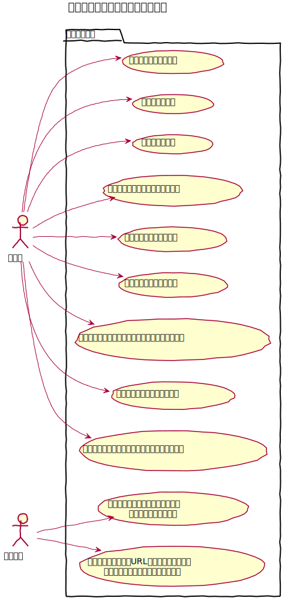
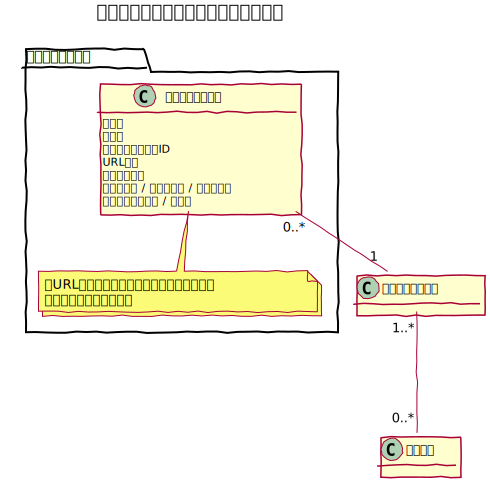

# アクセス設定設計書

各領域ごとのURLにおける各機能についてのアクセス制限を設定する機能。

## 前提条件

- ユーザーグループに対してアクセス制限設定を登録できる。
- システム管理グループ（admins）に対しては登録できない。
- 設定についてはシステム管理グループのみ登録、変更ができる。

## ユースケース図

## ドメインモデル図
### アクセス制限設定管理

## 領域定義

領域とは、アクセス設定の対象となる領域で次のようなものを指す。  
- Admin：管理画面
- Api：Web API
- Mypage：マイページ（本体に実装はしない）

## アクセス基本設定
各グループごとに領域ごとについての基本設定を行う。  
[アクセス基本設定](./permission_setting)

## アクセスルール
各領域ごとのアクセス制限におけるルールを設定する。  
[アクセスルール設定](./permissions)  

## アクセスグループ
主にコントローラー単位にてアクセスルールをグルーピングする。  
[アクセスルールグループ](./permission_groups)
