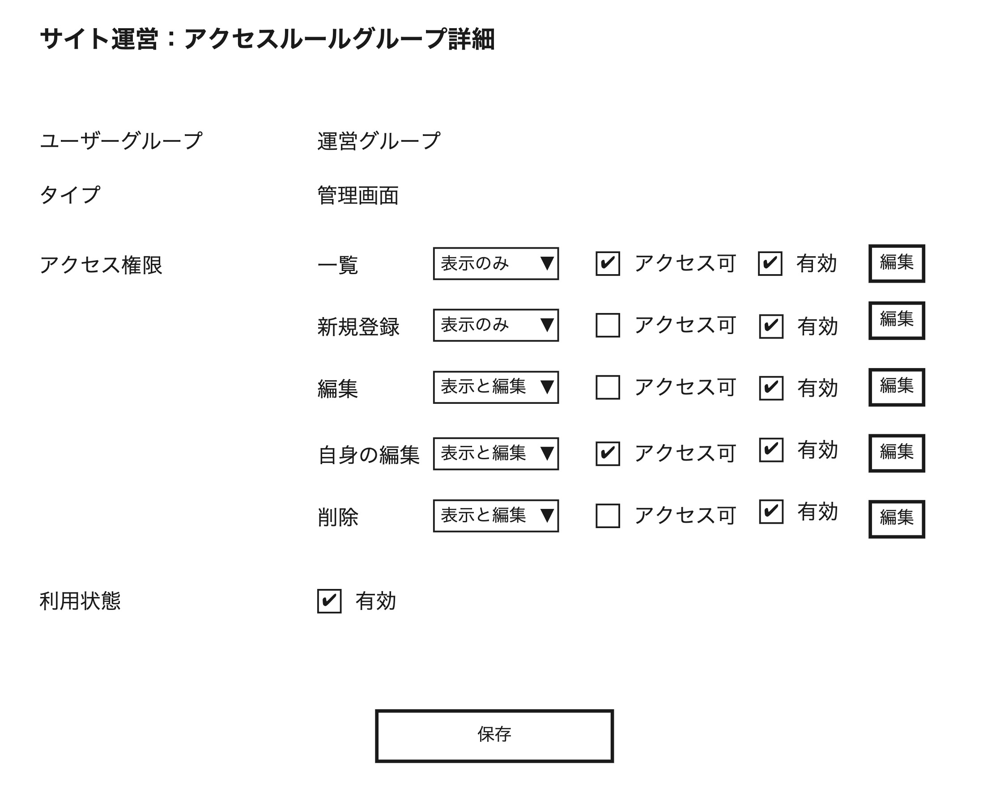
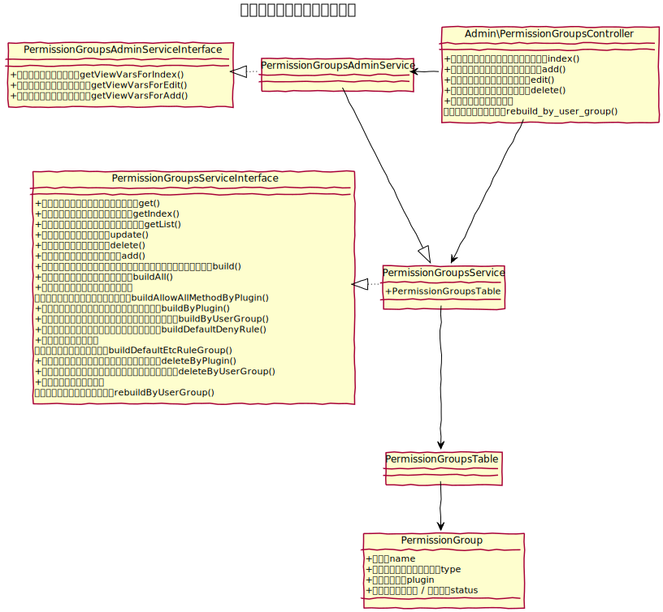
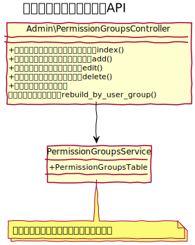

# アクセスグループ設計書

主にコントローラー単位にてアクセスルールをグルーピングする事ができる。   
膨大な量のアクセスルールをグルーピングし認識しやすいUIにする事が目的。

## 機能
### 一覧
アクセスルールグループの一覧を表示する。検索は提供しないが、領域で切り替えれる。  

アプリケーション側が提供する初期設定（初期ビルド）で運用する事を前提とし、連続登録が行いやすいUIではなく、カスタマイズにおける微調整がしやすいUIとする。

また、グループにぶら下がるルール数を表示する。

### 編集
グループにぶら下がる、ルールを全て表示し、各ルールの権限とアクセス可否を一括で保存できる。

また、グループにステータスを持ち、グループのステータスが無効の場合は、配下のルールも全て無効の取り扱いとなる。

### ルール再構築
対象のユーザーグループに関連するアクセスルールを全て再構築する。  
追加で削除していた場合、そのデータは削除される。  
[アクセスルールのビルド](../common/permission#アクセスルールの自動ビルド)を参照

### 新規登録
アクセスグループの作成は、インストール時、または、再構築時にアクセス定義ファイルを参照して自動構築する仕様となるが、上記２つの実行時以外のタイミングで新しく登録したい場合に備え、新規登録画面も提供する。

## クラス図
### アクセスグループ

 
### アクセスグループAPI

