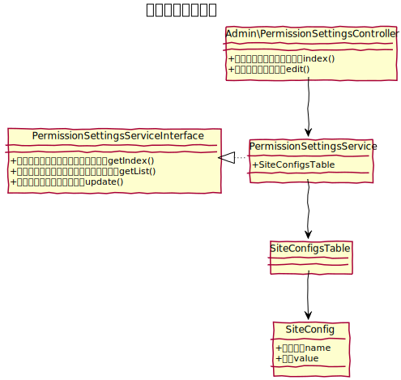

# アクセス基本設定設計書
各ユーザーグループごとに領域ごとについての基本設定を行う。

## 機能
### アクセス基本設定
各領域ごとに次のアクセス設定を行う。
- フルアクセス
- 限定アクセス

限定アクセスの場合には、アクセスルールグループやアクセスルールにてルールを設定できる。

### アクセスルールグループ一覧への導線
各領域のアクセスルールグループの一覧への導線も提供する。

### 領域定義
領域定義については、[プレフィックス認証](../common/prefix_auth) を参照する。

　
## クラス図
### アクセス基本設定

