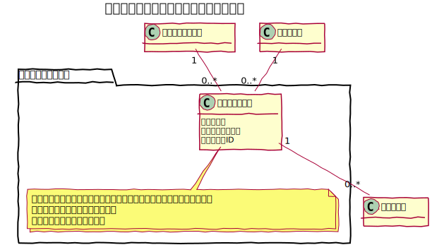

# ブログカテゴリ

ブログ記事を分類するためのカテゴリを管理する事ができる。

## ユースケース図


　
## 機能
### カテゴリ一覧を表示する
管理画面にてカテゴリの一覧を表示する。  
`TreeBehavior` を利用して、親子関係がわかる表示形式の一覧とし、ページネーションや表示件数の切り替え機能は提供しない。

### カテゴリを作成する
新しいカテゴリを作成する。

### カテゴリを編集する
既存のカテゴリの内容を変更する。カテゴリ名を変更した場合は、URLも変更となるので注意が必要。

### カテゴリを削除する
既存のカテゴリを削除する。子が存在する場合には子のも削除する。  
所属する記事は削除せず、無所属の記事に設定する。

### カテゴリを一括削除する
指定したカテゴリを一括で削除する。

### フロントのカテゴリ別の記事一覧を表示する
URLを指定して対象となるカテゴリに所属する記事の一覧を表示する。
```
// URL形式
/{ブログコンテンツ名}/archives/category/{カテゴリ名}
// 例
/news/archives/category/topcs
```

　
## ucmitzにおける仕様変更
### 隠しフィールドの owner_id を削除
案件固有の仕様だったため削除

　
## ドメインモデル図


　
## クラス図
### 管理画面


　
### API

