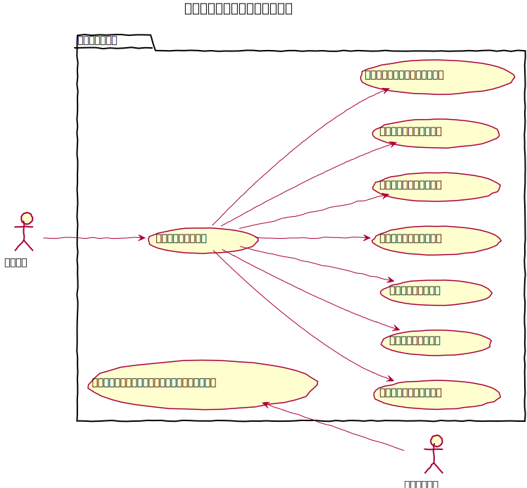
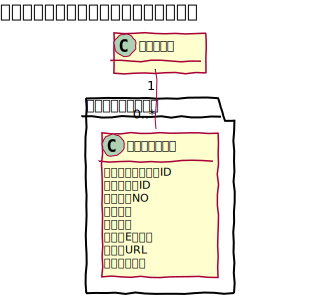
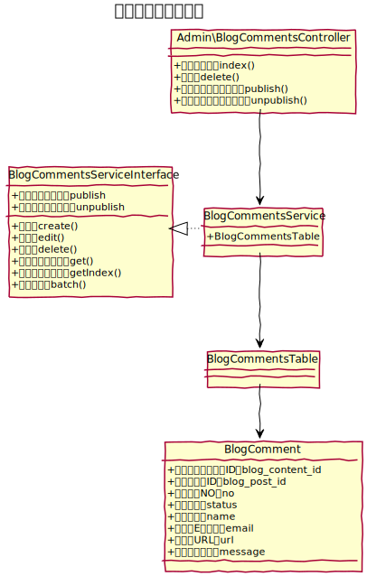

# ブログコメント設計書

ブログ記事に付与するタグを管理することができる。

## ユースケース図

 
## 機能
### ブログコメント一覧を表示する
管理画面にてブログコメントの一覧を表示する。  

#### 機能
一覧では次の機能を提供する。
- 削除
- 公開
- 非公開

#### 一括処理
指定したブログ記事について一括にて次の処理ができる。
- 削除
- 公開
- 非公開

### ブログ記事を削除する
既存のブログコメントを削除する。

### フロントでブログ記事にコメントを投稿する
指定したブログ記事に、任意のコメントを投稿する。
 
## ドメインモデル図

 
## クラス図
### 管理画面

 
### API

