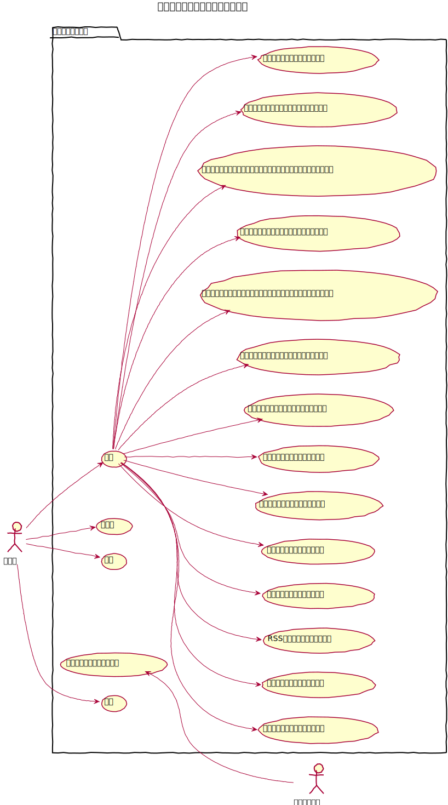
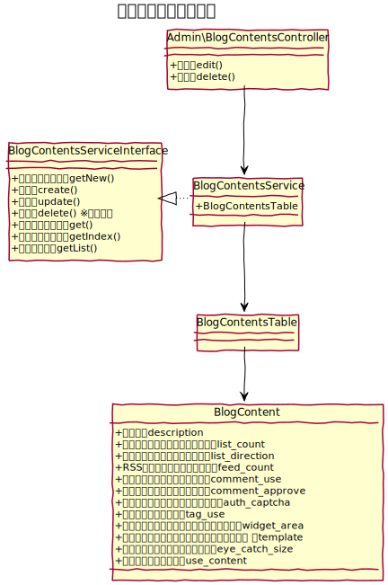
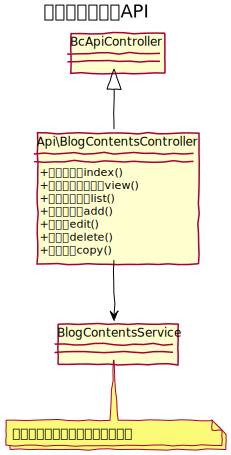

# ブログコンテンツ 

複数の記事を束ねるブログの各種設定を行う。  
ブログはコンテンツ管理上に複数設置する事ができる。 

## ユースケース図

 
## 機能

### フロント
#### フロントの記事一覧を表示する
フロントページにおいて、ブログ記事の一覧を表示する。  
編集画面にて設定した件数を表示する。

### 管理機能
#### 追加
コンテンツ管理より、フォルダを指定して新しいブログを配置する事ができる。

#### 変更
ブログの説明文を変更できる他、下記の設定変更ができる。

- **フロントの記事一覧の表示件数**:  フロントの記事一覧ページの記事表示件数を設定できる。
- **フロントの記事一覧の表示順**:  フロントの記事一覧ページの表示順を変更できる。
  - 新しい記事順
  - 古い記事順
- **RSSフィードの出力記事件数**: RSSフィードにおける出力記事件数を変更できる。
- **コメント受付機能の利用状態**: ブログ記事に対してコメントを投稿できるようにするかどうか設定できる。
- **コメント承認機能の利用状態**: 上記コメントを投稿した際、ログインユーザーが承認するまで表示しないようにするかどうか設定できる。
- **コメントイメージ認証の利用状態**: コメントを投稿する際にイメージ認証を利用するかどうか設定できる。
- **タグ機能の利用状態を変更する**: ブログ記事に対してタグを付与できるかどうか設定できる。オフにした場合、ブログ記事編集画面のタグの登録欄を非表示にする。
- **フロントに表示するウィジェットエリア**: フロントページにおいて表示するウィジェットを変更できる。
- **フロントで利用するレイアウトテンプレート**: フロントページにおいて利用するレイアウトテンプレートを変更できる。  
- **フロントで利用するレイアウトテンプレートの編集画面に遷移する**: レイアウトテンプレートの編集画面へのリンクを表示する。BcThemeFile プラグインがインストールされている場合に有効。
- **フロントで利用するコンテンツテンプレート**:: フロントページにおいて利用するコンテンツテンプレートを変更できる。コンテンツテンプレートは、`templates/Blog/` に配置したフォルダを表示する。  
- **フロントで利用するコンテンツテンプレートの編集画面に遷移する**: コンテンツテンプレートの編集画面へのリンクを表示する。BcThemeFile プラグインがインストールされている場合に有効。
- **アイキャッチのリサイズサイズを変更する**: ブログ記事のアイキャッチを設定する際のりサイズサイズを変更できる。
- **記事概要の利用状態を変更する**: ブログ記事の記事概要を利用するかどうか設定できる。オフにした場合は、ブログ記事編集画面の記事概要を非表示にする。

#### プレビュー
ブログ一覧のプレビューを行う。

#### 削除
ブログを削除する。削除の際、関連するブログ記事は全て削除する。

#### コピー
ブログをコピーする。コピー元のブログに関連する記事も同時にコピーする。  
カテゴリはコピーせず、ブログ記事のカテゴリは未所属とする。

 
## ドメインモデル図

 
## クラス図
### 管理画面

 
### API

