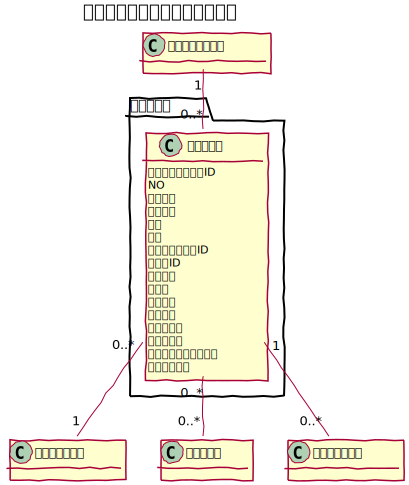
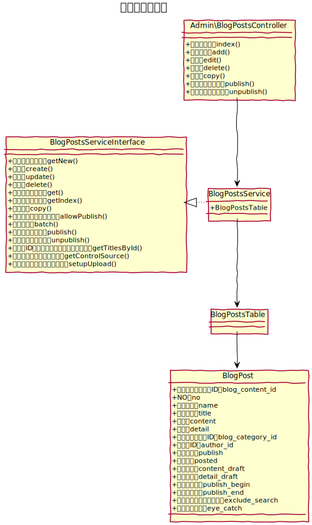

# ブログ記事設計書

ブログ記事を管理することができる。

## ユースケース図


 
## 機能
### ブログ記事一覧を表示する
管理画面にてブログ記事の一覧を表示する。ページネーションや表示件数の切り替え機能を提供する。  

#### 検索機能
次の項目で検索ができる。
- タイトル
- 公開状態
- 作成者

#### 機能
一覧では次の機能を提供する。
- コピー
- 削除
- 公開状態の切り替え

#### 一括処理
指定したブログ記事について一括にて次の処理ができる。
- 削除
- 公開状態に設定
- 非公開状態に設定

### ブログ記事を作成する
新しいブログ記事を作成する。   
作成時、画面内で、新しいカテゴリ、新しいタグの登録ができる。

ただし、所属ブログコンテンツでタグ機能が利用不可の場合は、タグの設定はできず、新しいタグの登録もできない。

### ブログ記事を編集する
既存のブログ記事の内容を変更する。スラッグを変更した場合は、URLも変更となるので注意が必要。
編集時、画面内で、新しいカテゴリ、新しいタグの登録ができる。

### ブログ記事を削除する
既存のブログ記事を削除する。コメントが存在する場合にはコメントも削除する。

### フロントの記事一覧を表示する
URLを指定して対象となるブログの記事の一覧を表示する。  
１ページあたり、所属するブログコンテンツで設定された記事数を表示する。  
また、並び順は、所属するブログコンテンツで設定された並び順とする。

```
// カテゴリ別記事一覧
/{ブログコンテンツ名}/archives/category/{カテゴリ名}

// タグ別記事一覧
/{ブログコンテンツ名}/archives/tag/{タグ名}

// 著者別記事一覧
/{ブログコンテンツ名}/archives/author/{作成者アカウント名}

// 年別記事一覧
/{ブログコンテンツ名}/archives/date/2023

// 月別記事一覧
/{ブログコンテンツ名}/archives/date/2023/01

// 日別記事一覧
/{ブログコンテンツ名}/archives/date/2023/01/01
```

### フロントの記事詳細を表示する
URLを指定して対象となるブログの記事の詳細を表示する。

```shell
// スラッグなし
/{ブログコンテンツ名}/archives/{記事NO}

// スラッグあり
/{ブログコンテンツ名}/archives/{スラッグ}
```
#### コメント機能
ブログコンテンツの設定にて、コメント機能が有効になっていると、ブログ記事にコメントを投稿することができる。

 
## ucmitzにおける仕様変更
### 投稿日のフィールド名変更
posts_date ➔ posted

### タイトルのフィールド名変更
name ➔ title

### スラッグを追加
既存の name フィールドをスラッグとして利用

 
## ドメインモデル図


 
## クラス図
### 管理画面


 
### API

