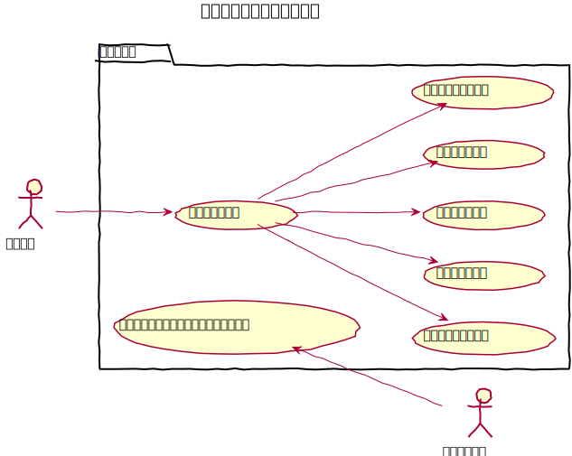
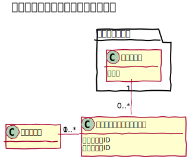
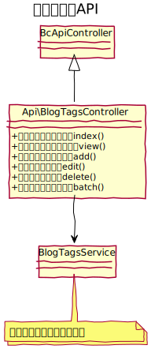

# ブログタグ設計書

ブログ記事に付与するタグを管理することができる。

## ユースケース図

　
## 機能
### ブログタグ一覧を表示する
管理画面にてブログタグの一覧を表示する。  

#### 機能
一覧では次の機能を提供する。
- 削除

#### 一括処理
指定したブログ記事について一括にて次の処理ができる。
- 削除

### ブログタグを作成する
新しいブログタグを作成する。

### ブログタグを編集する
既存のブログタグの名称を変更する。

### ブログ記事を削除する
既存のブログガグを削除する。

### フロントでタグ別記事一覧を表示する
URLを指定して対象タグに関連する記事の一覧を表示する。
　
## ドメインモデル図

　
## クラス図
### 管理画面

　
### API

