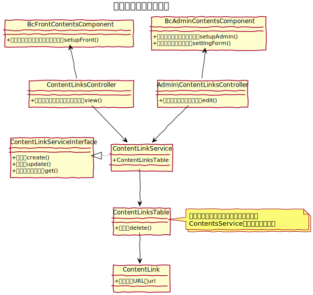
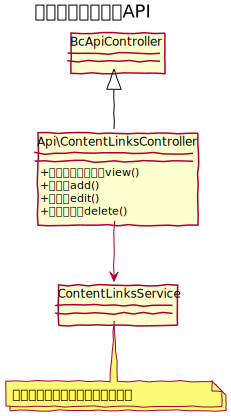

# コンテンツリンク設計書

コンテンツリンクとは、コンテンツ管理のメニュー機能を利用して、メニュー内にサイトの内外へのリンクを配置する機能です。
　
## ユースケース図

　
## 機能

### フロントページのメニューに任意のリンクを配置
コンテンツ管理よりリンクを配置すると、コンテンツ管理により自動生成されたメニューに他のコンテンツと同様に配置される。  
メニューのリンクをクリックすると、指定したリンク先URLにリダイレクトする。

　
## ドメインモデル図

　
## クラス図
### コンテンツリンク管理

　
### コンテンツリンクAPI

　

