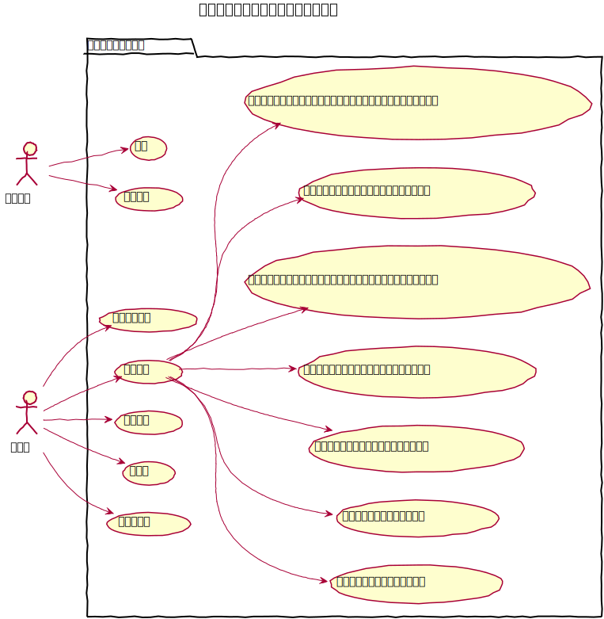
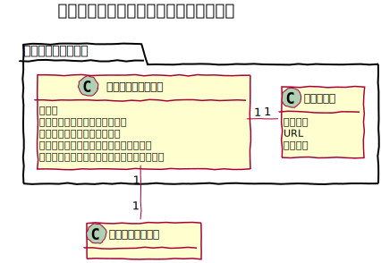
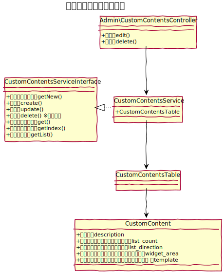
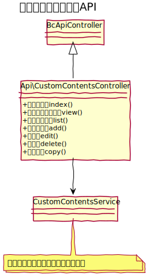

# カスタムコンテンツ設計書

コンテンツ管理機能に独自フィールド定義のコンテンツを配置する事ができます。

## ユースケース図

 
## 機能
### フロント
#### フロントのエントリー一覧を表示する
フロントページにおいて、エントリーの一覧を表示する。編集画面にて設定した件数を表示する。

#### エントリーを検索する
// TODO 仕様検討中
できれば、管理画面で検索に利用するフィールドを指定して自動生成したい
　
### 管理機能
#### 追加
コンテンツ管理より、フォルダを指定して新しいコンテンツを配置する事ができる。

#### 変更
下記の設定変更ができる。

- **テーブル**: コンテンツ管理に紐付けるテーブルを選択できる。テーブルタイプが「コンテンツ」となっているものを対象とする。
- **フロントのエントリー一覧の表示件数**:  フロントのエントリー一覧ページの表示件数を設定できる。
- **フロントのエントリー一覧の表示順**:  フロントのエントリー一覧ページの表示順を変更できる。
  - 並べ替え対象フィールド 
  - 昇順・降順
- **フロントに表示するウィジェットエリア**: フロントページにおいて表示するウィジェットを変更できる。
- **フロントで利用するレイアウトテンプレート**: フロントページにおいて利用するレイアウトテンプレートを変更できる。（コンテンツ管理側の実装）
- **フロントで利用するレイアウトテンプレートの編集画面に遷移する**: レイアウトテンプレートの編集画面へのリンクを表示する。BcThemeFile プラグインがインストールされている場合に有効。（コンテンツ管理側の実装）
- **フロントで利用するコンテンツテンプレート**:: フロントページにおいて利用するコンテンツテンプレートを変更できる。コンテンツテンプレートは、`templates/CustomContent/` に配置したフォルダを表示する。  
- **フロントで利用するコンテンツテンプレートの編集画面に遷移する**: コンテンツテンプレートの編集画面へのリンクを表示する。BcThemeFile プラグインがインストールされている場合に有効。

#### エントリー一覧への遷移
コンテンツ管理画面からエントリー一覧への遷移を行う際、コンテンツ管理は、エントリー一覧で必要となるテーブルIDを知らないため、一度、カスタムコンテンツ管理のコントローラーに遷移した上でリダイレクトさせる仕様とする。

#### プレビュー
フロントのエントリー一覧を非公開状態でもプレビューとして確認できる。

#### 削除
コンテンツを削除する。削除の際、関連するテーブルとの関連付けだけを削除し、エントリー等全てのデータは残す仕様とする。

 
## ドメインモデル図

 
## クラス図
### 管理画面

　
### API

