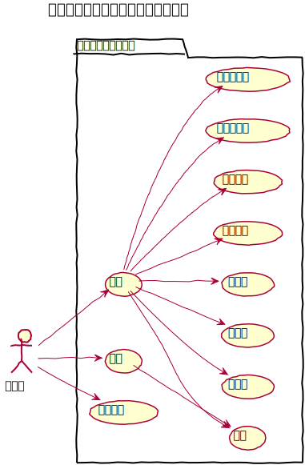
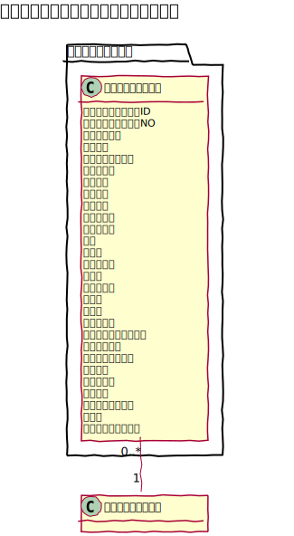
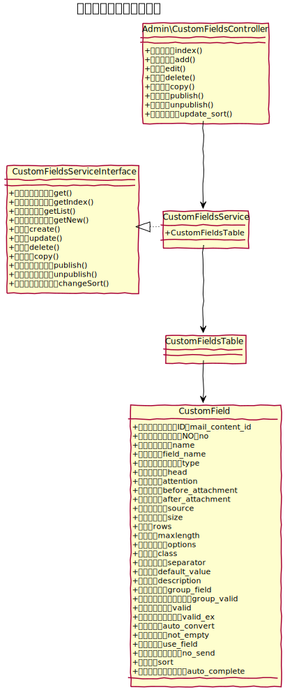

# カスタムフィールド設計書

独自コンテンツに対するフィールドを定義できる機能です。

## ユースケース図

　
## 管理機能
### 一覧
カスタムフィールドを一覧で表示する。ページネーションは実装しない。
#### 有効化
カスタムフィールドを有効化する。
#### 無効化
カスタムフィールドを無効化する。
#### コピー
カスタムフィールドをコピーする。コピーの際、カスタムポストテーブルのフィールドも追加する。
#### 削除
カスタムフィールドを削除する。削除の際、メッセージテーブルのフィールドも削除する。
#### 並べ替え
カスタムフィールドの表示順を並べ替える。
#### 一括処理
一括処理として次の機能を提供する。
- 削除
- 有効化
- 無効化

### 新規追加
新しいカスタムフィールドを追加する。追加の際、カスタムポストテーブルのフィールドも追加する。

### 編集
既存のカスタムフィールドの設定を編集する。編集の際、フィールド名が変更となった場合は、カスタムポストテーブルのフィールド名も変更する。
　
## ドメインモデル図

　
## クラス図
### 管理画面

　
### API

