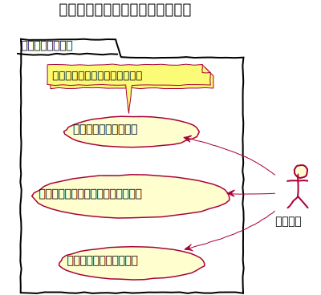
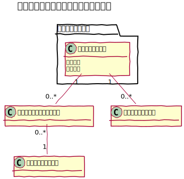
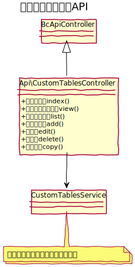

# カスタムテーブル設計

コンテンツ管理で利用できるコンテンツ、または、カテゴリやタグのマスターとして利用するためのテーブルを作成する事ができる。

## ユースケース図

## 機能
### フィールドとの関連付け
カスタムテーブルで定義したフィールドを複数関連付けることができ、削除もできる。  
関連付けを追加した際には、カスタムエントリーにカラムとして追加し、削除した場合は、対象カラムを削除する。

### プレビュー
コンテンツ管理と連携している場合には、非公開状態の場合でもプレビューを確認することができる。

### 階層設定
関連するカスタムエントリーが階層化情報を持つかどうかを定義できる。

## ドメインモデル図

　
## クラス図
### 管理画面

　
### API

