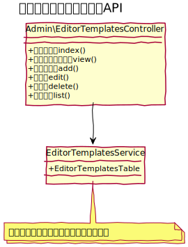

# エディターテンプレート

CKEditorで利用するためのエディターテンプレートを管理する事ができる。

## ユースケース図

 
## 機能
### エディターテンプレート一覧を表示する
管理画面にてエディターテンプレートの一覧を表示する。  

### エディターテンプレートを作成する
新しいエディターテンプレートを作成する。

### エディターテンプレートを編集する
既存のエディターテンプレートの内容を変更する。

### エディターテンプレートを削除する
既存のエディターテンプレートを削除する。

### エディターテンプレートの設定をJSで呼び出す
CKEditorで利用するテンプレート用の設定をJSで呼び出す。

　
 
## ドメインモデル図

 
## クラス図
### 管理画面

 
### API

