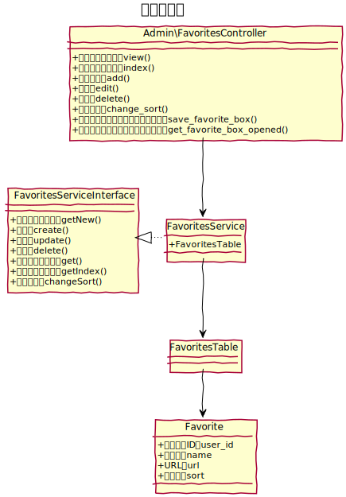

# お気に入り設計

管理画面の各画面へのショートカットをお気に入りとして保存できる。

## ユースケース図

　
## 機能
### 一覧表示
#### 表示方法
サイドバーのメニュー上部に、 `beforeAdminMenu` イベントを利用して表示する。
#### クリック
クリックすると登録されているURLに遷移する。
#### 右クリック
右クリックすると、編集と削除をするためのコンテキストメニューを表示する。

### 登録
新規登録ボタンは、「お気に入りに追加」として `beforeContentsMenu` イベントを利用して表示する。  
新規登録ボタンをクリックすると、新規登録画面が起動し、現在表示している画面のタイトルとURLを初期値として表示する。  
登録前に、タイトル、URLは変更が可能とする。  
保存時にタイトル、URLのどちらかが空欄の場合はリアルタイムでバリデーションを表示する。

### 編集
一覧より、対象となるお気に入りを右クリックし、編集を選択すると、編集画面が起動する。  
保存時にタイトル、URLのどちらかが空欄の場合はリアルタイムでバリデーションを表示する。

### 削除
一覧より、対象となるお気に入りを右クリックし、削除を選択すると、お気に入りを削除する。

### 並べ替え
並べ替えたい対象のお気に入りを上下にドラッグする事で並び順を変更する。

　
## ドメインモデル図
### お気に入り

　
## クラス図
### お気に入りAPI

