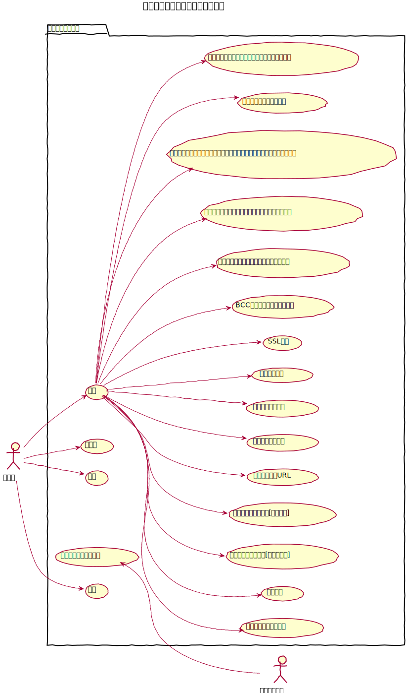
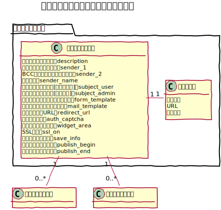
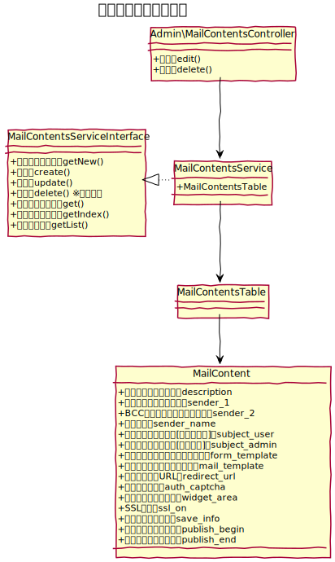
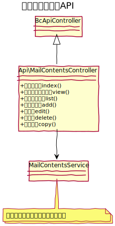

# メールコンテンツ設計書

メールフォームの各種設定を行う。  
メールフォームはコンテンツ管理上に複数設置する事ができる。 

## ユースケース図

　
## 機能
### フロント
#### フロントのメールフォームを表示する
フロントページにおいて、メールフォームを表示する。

### 管理機能
#### 追加
コンテンツ管理より、フォルダを指定して新しいメールフォームを配置する事ができる。

#### 変更
メールフォームの説明文を変更できる他、下記の設定変更ができる。

- **送信先メールアドレス**: メールフォーム送信時にメールを送信する宛先を設定できる。
- **送信先名**:自動返信メールの送信者に表示します。入力がない場合、サイト名が設定されます。送信者名に変更
- **自動返信メール件名[ユーザー宛]**: ユーザー宛の自動返信メールの件名を設定できる。
- **自動送信メール件名[管理者宛]**: 管理者宛の自動送信メールの件名を設定できる。
- **リダイレクトURL**: メール送信後、別のURLにリダイレクトする場合にURLを指定します。コメントのhttp を https へ
- **フォーム受付期間**: 公開期間とは別にフォームの受付期間を設定する事ができます。受付期間外にはエラーではなく受付期間外のページを表示します。受付期間外ページの確認
- **データベース保存**: メールフォームから送信された情報をデータベースに保存するかどうかを指定できます。
- **イメージ認証**: メールフォーム送信の際、表示された画像の文字入力させる事で認証を行ないます。
- **SSL通信**: メールフォームでSSL通信を利用するかどうかを設定できます。廃止を検討
- **BCC用送信先メールアドレス**: BCC（ブラインドカーボンコピー）用のメールアドレスを指定します。複数の送信先を指定するには、カンマで区切って入力します。
- **フロントで利用するウィジェットエリア**: フロントで利用するウィジェットエリアを設定できます。プラグインの利用状態によって表示を切り替える 
- **フロントで利用するメールフォームテンプレート**: フロントで利用するメールフォームテンプレートを変更できます。 
- **フロントで利用するメールフォームテンプレートの編集画面に遷移する**: メールフォームテンプレートの編集画面へのリンクを表示する。BcThemeFile プラグインがインストールされている場合に有効。プラグインの利用状態によって表示を切り替える
- **送信メールテンプレート**: 送信メールテンプレートを変更できます。
- **送信メールテンプレートの編集画面に遷移する**: 送信メールテンプレートの編集画面へのリンクを表示する。BcThemeFile プラグインがインストールされている場合に有効。プラグインの利用状態によって表示を切り替える

#### プレビュー
メールフォームのプレビューを行う。

#### 削除
メールフォームを削除する。削除の際、関連するメールフィールドやメールメッセージは全て削除する。

#### コピー
メールフォームをコピーする。コピー元のメールフォームに関連するメールフィールドも同時にコピーする。

　
## ドメインモデル図

　
## クラス図
### 管理画面

　
### API

