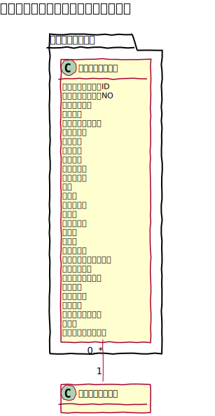
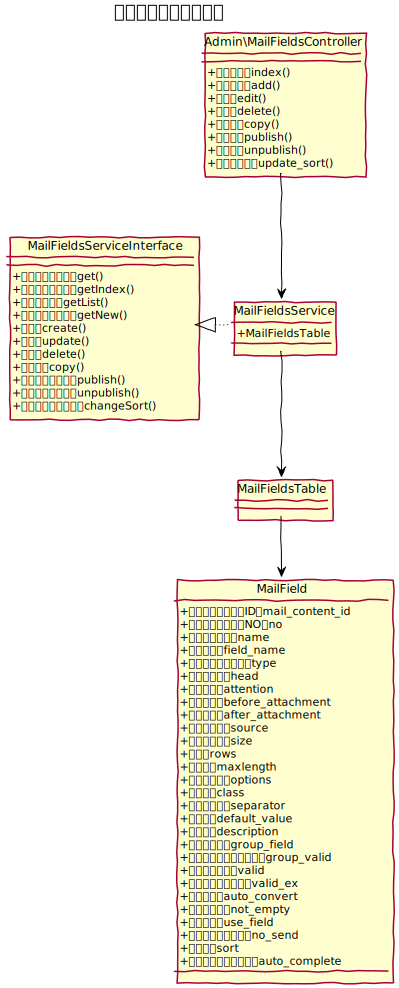
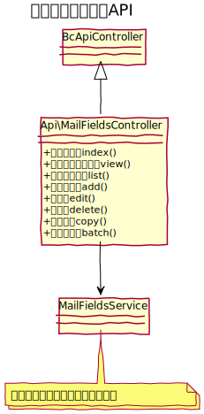

# メールフィールド設計書

メールフォームのフィールド管理を行う。

## ユースケース図

　
## 管理機能
### 一覧
メールフィールドを一覧で表示する。ページネーションは実装しない。
#### 有効化
メールフィールドを有効化する。
#### 無効化
メールフィールドを無効化する。
#### コピー
メールフィールドをコピーする。コピーの際、メッセージテーブルのフィールドも追加する。
#### 削除
メールフィールドを削除する。削除の際、メッセージテーブルのフィールドも削除する。
#### 並べ替え
メールフィールドの表示順を並べ替える。
#### 一括処理
一括処理として次の機能を提供する。
- 削除
- 有効化
- 無効化

### 新規追加
新しいメールフィールドを追加する。追加の際、メッセージテーブルのフィールドも追加する。

### 編集
既存のメールフィールドの設定を編集する。編集の際、フィールド名が変更となった場合は、メッセージテーブルのフィールド名も変更する。

## ucmitzにおける変更点
### separator フィールド を削除
CakePHP側にてハードコーディングで項目を結合してしまう処理が入ってしまったため、区切り文字の設定は削除となりました。CSSで調整してください。

### valid フィールドを boolean 型に変更
必須項目は、マルチチェックボックスも含め、valid フィールドにまとめ、メールアドレスや数値の型チェックは、valid_ex フィールドにまとめています。

### valid_ex フィールドのソースを追加
下記のソースが、valid から移動となっています。
- VALID_EMAIL: メール形式チェック
- VALID_NUMBER: 数値チェック（/^(|[0-9]+)$/と、/^([0-9]+)$/ が対象）

### rows フィールド を text_rows に変更
separator と同様の理由でリネーム。
　
## ドメインモデル図

　
## クラス図
### 管理画面

　
### API

