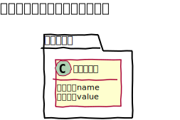
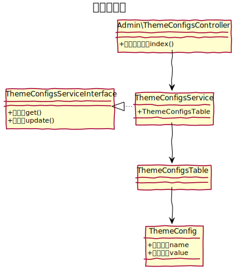
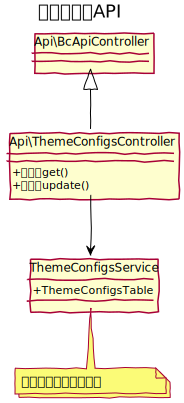

# テーマ設定設計書

## ユースケース図


## 機能
### 管理機能
#### 編集
既存のテーマ設定を編集する。
- **ロゴ**: ロゴ画像を１点登録できる。
- **メインイメージ**: メインイメージを５点登録できる。
- **テーマカラー**: メインカラー、サブカラー、テキストリンク、テキストホバーの４つのカラーを設定できる。

### フロント機能
#### ロゴ出力
次の関数でロゴを出力できる。
```php
$this->BcBaser->logo();
```
#### メインイメージ出力
次の関数でメインイメージを出力できる。
```php
$this->BcBaser->mainImage();
```
#### テーマ設定CSS読み込み
現在のテーマの指定した場所にベースとなるCSSファイルを配置しておくと、指定したキーワードを管理画面での設定値に置き換え、フロントエンドから読み込める場所に出力し、自動で読み込むことができる。

```shell
# ベースとなるCSS
/plugins/{テーマ名}/webroot/css/config.css

# 置き換え対象のキーワード
- MAIN: メインカラー
- SUB: サブカラー
- LINK: テキストリンクカラー
- HOVER: テキストホバーカラー

# 出力先
/webroot/files/theme_configs/config.css
```

　
## ドメインモデル図


　
## クラス図
### 管理画面



### API
 

