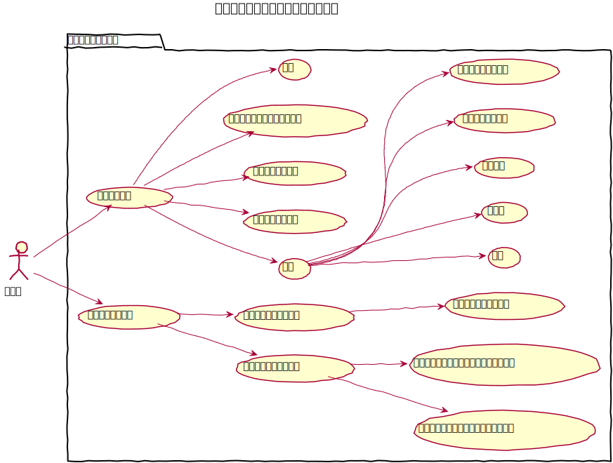
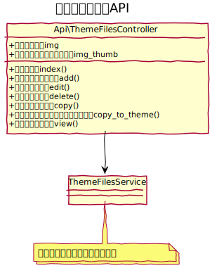

# テーマファイル管理設計

## ユースケース図

## 機能
### 現在のテーマ
#### 一覧
現在のテーマのファイルとフォルダの一覧を表示する。

#### 削除
現在のテーマのファイル、またはフォルダを削除する。

#### コピー
現在のテーマのファイル、または、フォルダをコピーする。

#### 一括処理
一括処理として次の機能を提供する
- 一括削除

#### タイプを変更する
一覧に表示する対象のタイプを変更する。タイプは次のものがある。
- レイアウト
- エレメント
- Eメール
- CSS
- 画像
- Javascript
- それ以外のコンテンツ

#### フォルダを変更する
一覧に表示する対象のフォルダを変更する。

#### フォルダ新規作成
現在のフォルダに新しくフォルダを作成する。

#### ファイル新規作成
現在のフォルダに新しくファイルを作成する。

#### ファイルをアップロードする
現在のフォルダに新しくファイルをアップロードする。

#### 編集
テキストファイルの場合は、ファイル名とファイル内容を変更できる。ただし、拡張子は変更できない。  
フォルダや画像の場合は名称変更のみできる。

### コアテンプレート
#### コアテンプレート一覧
コアテンプレートのファイルとフォルダの一覧を表示する、

#### コアテンプレートのタイプを変更する
一覧に表示する対象のタイプを変更する。

#### コアテンプレートのフォルダを変更する
一覧に表示する対象のフォルダを変更する。

#### コアテンプレート確認
コアテンプレートの内容を表示する。

#### 現在のテーマにコピー
対象のファイルやフォルダを現在のテーマの同階層にコピーする

 
## クラス図
### 管理画面

### API
#### テーマフォルダー
 
#### テーマファイル

