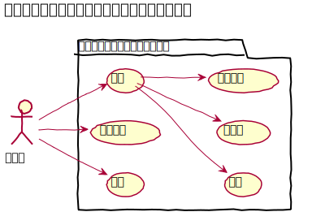
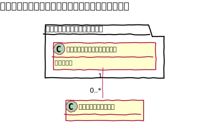
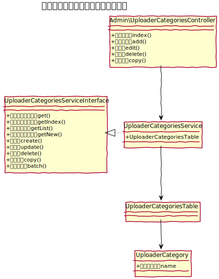
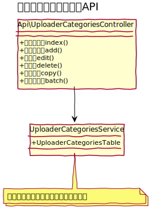

# アップロードカテゴリ設計書

## ユースケース図

## 機能
### 一覧
アップロードカテゴリの一覧を表示する。ページネーションは実装しない。
### 新規作成
新しいアップロードカテゴリを作成する。
### 編集
既存のアップロードカテゴリを編集する。
### コピー
既存のアップロードカテゴリを複製する。
### 削除
既存のアップロードカテゴリを削除する。
### 一括処理
一括処理として次を提供する。
- 一括削除

## ドメインモデル図

　
## クラス図
### 管理画面

### API
 
