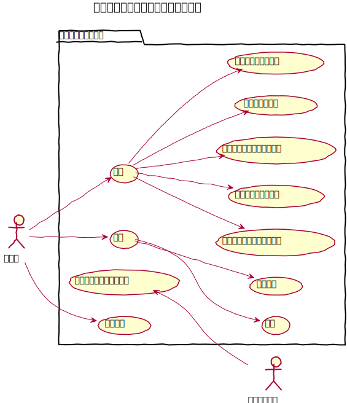
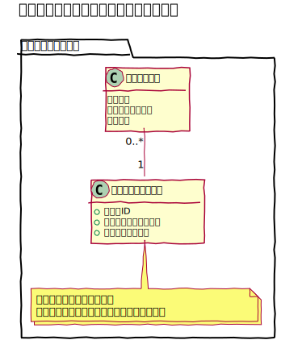
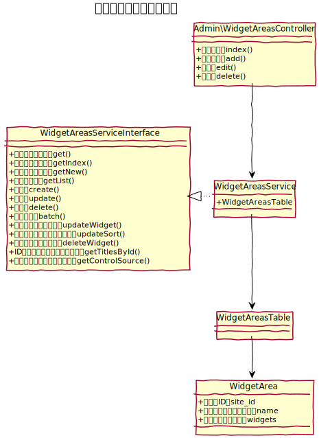
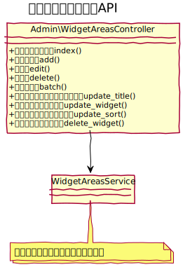

# ウィジェットエリア設計書

## ユースケース図


## 機能
### 管理機能
#### 一覧
ウィジェットエリアの一覧を表示する。

#### 削除
ウィジェットエリアを削除する。

#### 一括処理
一括処理として次の機能を提供する
- 一括削除
 
#### 新規作成
ウィジェットエリアを新しく作成する。作成時はウィジェットエリア名だけを入力する。

#### 編集
利用できるウィジェットのから目的のウィジェットを選択してウィジェットエリアの機能を変更する事ができる。
- **ウィジェットエリア名を変更**: ウィジェットエリアの名称を変更できる。
- **ウィジェットを追加**: 利用できるウィジェットから目的のウィジェットをドラッグ・アンド・ドロップで利用中のウィジェットに移動する事でウィジェットを追加できる。
- **ウィジェットの設定を変更**: 標準で、「タイトル」、「タイトルを表示」、「利用する」を装備し利用対象のウィジェットが装備する入力項目等を表示する。保存ボタンをクリックする事で保存できる。
- **ウィジェットを削除**: 利用中のウィジェットからウィジェットを削除する。
- **ウィジェットを並べ替える**: ドラッグ・アンド・ドロップで、ウィジェットの表示順を並べ替える事ができる。
 
### フロント機能
#### ウィジェットエリア表示
管理画面での設定に応じてウィジェットエリアを表示する。
全ページ共通のウィジェットは、システム設定で選択ができる。  
また、View変数、`$currentWidgetArea` をコントローラーやイベントで書き換える事で、表示するウィジェットを変更する事ができる。

また、ヘルパーで NO を直接指定する事もできる。

```php
$this->BcBaser->widgetArea(2);
```
　
### 利用できるウィジェットを追加
#### 管理画面側
ウィジェットの編集画面では、`templates/Admin/element/widgets/` に配置したテンプレートを「利用できるウィジェット」として読み込む。   

テンプレート内では、次の変数を定義しなければならない。
- **$title**: ウィジェット名。
- **$description**: ウィジェットの説明文

なお、入力欄を配置する場合には、フィールド名の名称の前に `$key.` を付けなければならない。

```php
echo $this->BcAdminForm->control($key . '.text', [
  'type' => 'textarea',
  'cols' => 38,
  'rows' => 14
]);
```

#### フロントエンド側
フロントエンドでは、`templates/element/widgets/` に配置したテンプレートを、管理画面のウィジェットエリア管理の「利用中のウィジェット」として設定したものに応じて読み込む。 

テンプレート内では次の変数が利用できる。
- **$name**: タイトル
- **$use_title**: タイトルを利用するかどうかの設定値
- **$id**: ウィジェットのID番号
- **その他**: 利用できるウィジェットとして作成したテンプレートで定義した、入力欄のフィールド名

```php
// フィールド名を 「$key . '.text'」として定義した場合、「$text」として利用する事ができる
<div class="bs-widget bs-widget-text bs-widget-text-<?php echo $id ?>">
	<?php if ($name && $use_title): ?>
		<h2 class="bs-widget-head"><?php echo $name ?></h2>
	<?php endif ?>
	<?php echo $text ?>
</div>
```

 
## ドメインモデル図


　
## クラス図
### 管理画面



### API
 
