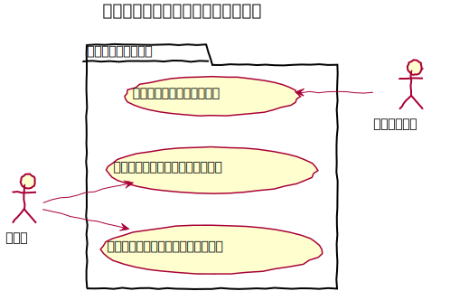

# コンテンツフォルダー設計書

コンテンツを整理するためのフォルダ。

## ユースケース図

コンテンツ自体の操作については [コンテンツ管理設計書](../contents/index.md) を参照

　
## 機能

### フロントページを表示する
対象フォルダに子として紐づくコンテンツの一覧を表示する。

### フォルダーテンプレートを変更する
フロントページの表示テンプレートを変更する。  
`templates/ContentFolders/` 配下に配置したテンプレートより選択する事ができる。

### 固定ページテンプレートを変更する
対象フォルダに子として紐づく固定ページにおける固定ページテンプレートを変更する。
`templates/Pages/` 配下に配置したテンプレートより選択する事ができる。

　
## ドメインモデル図
### コンテンツフォルダ管理

　
## クラス図
クラス図については [コンテンツ管理設計書](../contents/index.md) を参照

