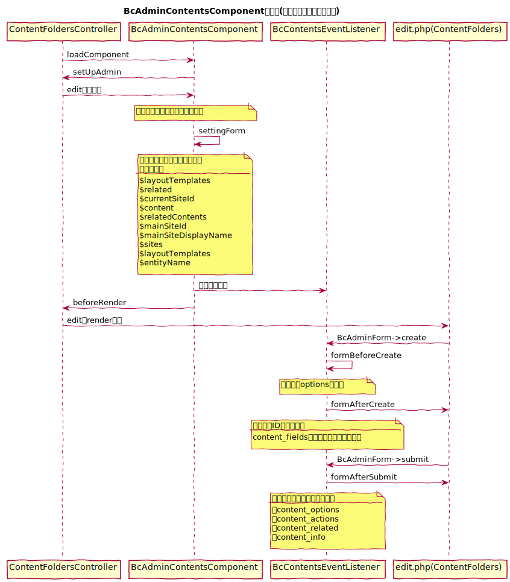
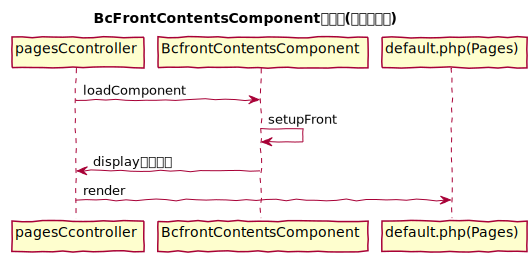

# コンテンツ管理用コンポーネント

## ucmitzにおける仕様変更

4系ではBcContentsComponentだったクラスを<b>管理画面用(BcAdminContentsComponent)</b>と<b>フロント画面用(BcFrontContentsComponent)</b>に分離している

　
## BcAdminContentsComponent

Admin/ContentFoldersController.php・Admin/ContentsController.phpなどの管理画面で使用

### 役割

- コンテンツアイテムの読み込み
- 管理画面で使用する変数を設定
- イベント設置(<u>BcContentsEventListener</u>)
  - ※ <u>BcContentsEventListener</u>では、フォーム画面に他のエレメントを結合するなど追加処理がある

### 編集処理

例）ContentFolder

#### シーケンス図

　
## BcFrontContentsComponent

Controller/PagesController.phpなどフロント画面で使用

### 役割

- プレビュー時のデータの設定
- レイアウトテンプレートの設定
- 説明文
- タイトルの設定

### ページ表示

例）Page

#### シーケンス図

