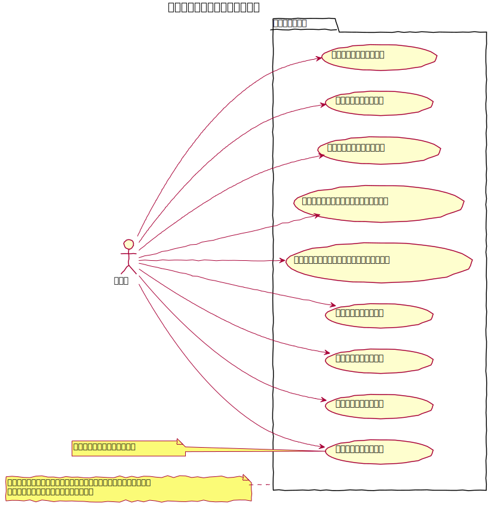
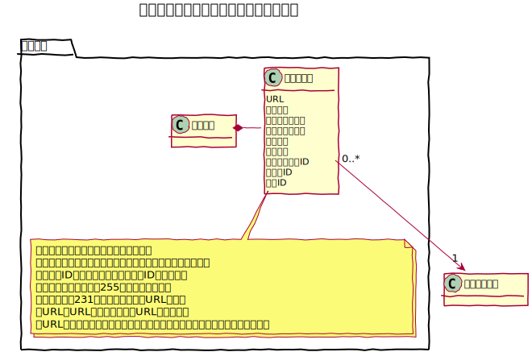
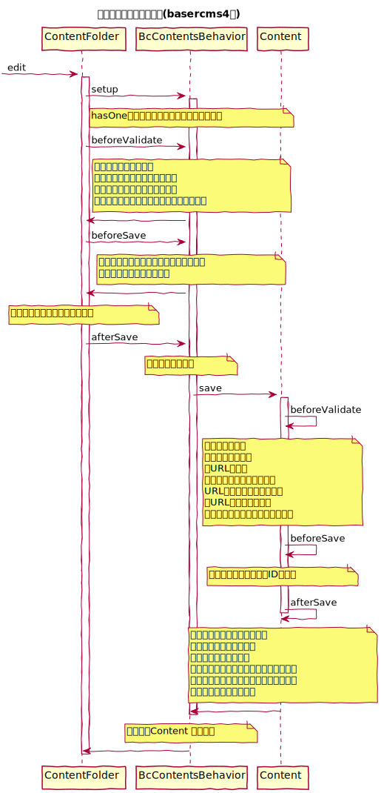
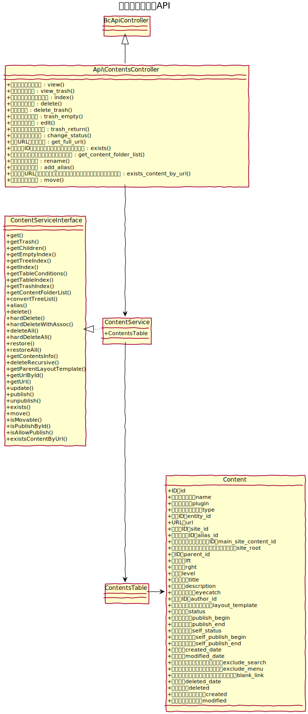
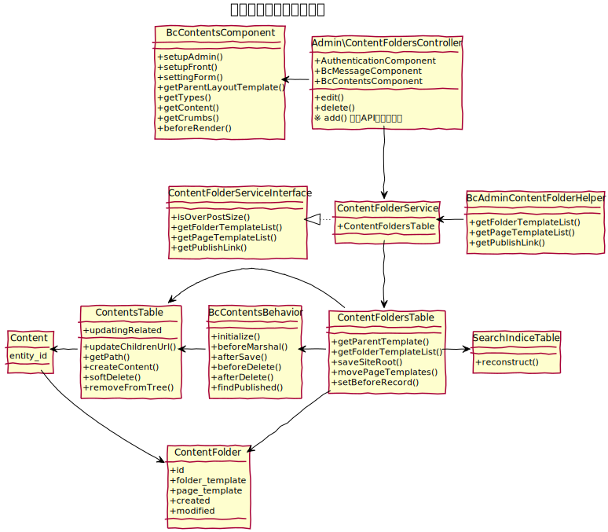

# コンテンツ設計書

## ユースケース図

## ドメインモデル図

## クラス図

## 特性
  - [論理削除機能](./soft_delete)
  - [ツリー構造機能](https://book.cakephp.org/4/ja/orm/behaviors/tree.html)
  - [コンテンツ管理用ビヘイビア](./bc_contents_behavior)
  - [コンテンツ管理用コンポーネント](./contents_component)

