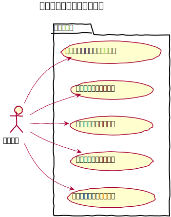

# お気に入り設計

管理画面の各画面へのショートカットをお気に入りとして保存できる。

## ユースケース図

　
## 機能
### 一覧表示
#### 表示方法
サイドバーのメニュー上部に、 `beforeAdminMenu` イベントを利用して表示する。
#### クリック
クリックすると登録されているURLに遷移する。
#### 右クリック
右クリックすると、編集と削除をするためのコンテキストメニューを表示する。

### 登録
新規登録ボタンは、「お気に入りに追加」として `beforeContentsMenu` イベントを利用して表示する。  
新規登録ボタンをクリックすると、新規登録画面が起動し、現在表示している画面のタイトルとURLを初期値として表示する。  
タイトル、URLは変更が可能とする。  
保存時にタイトル、URLのどちらかが空欄の場合はリアルタイムでバリデーションを表示する。

### 編集
一覧より、対象となるお気に入りを右クリックし、編集を選択すると、編集画面が起動する。  
保存時にタイトル、URLのどちらかが空欄の場合はリアルタイムでバリデーションを表示する。

### 削除

