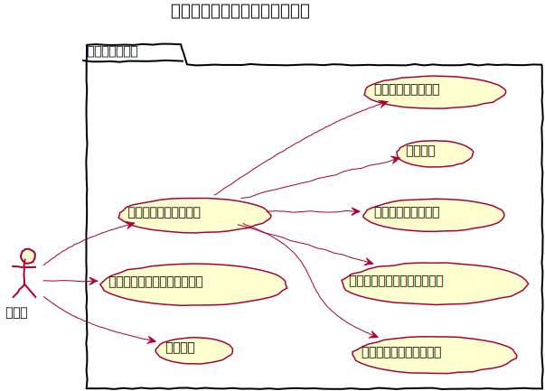
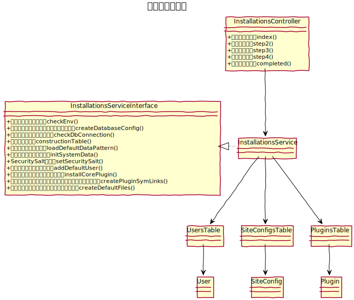

# インストーラー設計書

baserCMSのセットアップとして、サーバー環境のチェック、DBの構築、管理者ユーザーの作成、および、初期設定を行う。

## ユースケース図

　
## 機能
### ブラウザインストール
#### サーバー環境のチェック
##### 基本必須条件
インストール要件として次の項目をチェックする
- PHPバージョン：8以降
- 書込み権限のチェック
  - tmp
  - config
  - webroot/files
  - plugins

##### オプション要件
- PHPのメモリ上限

#### データベースの接続チェック
ホスト名、ユーザー名、パスッワード、DB名を入力し、データベースへの接続ができるか確認する。

#### データベースの構築
Migration を利用してデータベースにテーブルを作成する。

#### 初期設定
次について入力、選択し初期データのセットアップを行う。
- サイト名
- フロントテーマ
- 初期データパターン

※ セットアップ処理の実装については、Seedを利用するか CSV を利用するか検討する。

#### 管理ユーザーの作成
次について入力し、ログインするための管理ユーザーを作成する。
- メールアドレス
- パスワード

　
### コマンドラインインストール
ワンラインのコマンドでインストールができる。

　
### リセット
データベースと設定をリセットする。

　
### ucmitzにおける変更点
- インストーラーは、BcInstaller としてプラグイン化する
- BcManagerComponent を InstallationsService に移行する

　
## クラス図
### インストーラー

　
