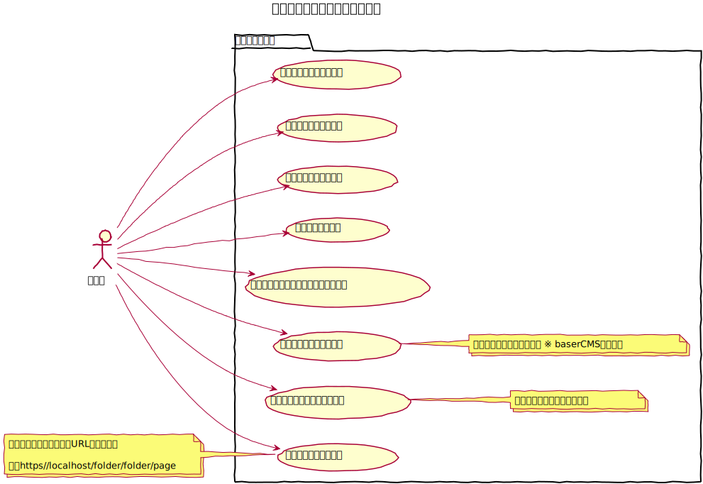
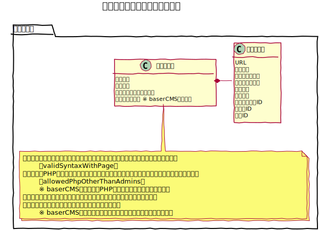
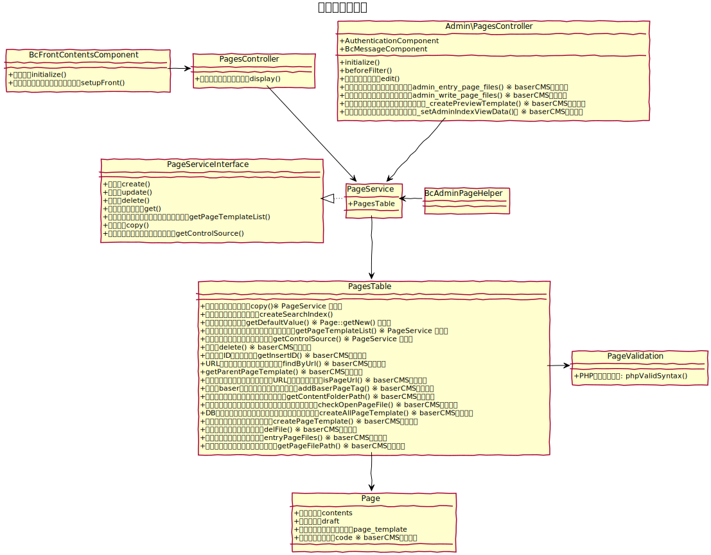
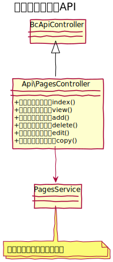

# 固定ページ設計書

固定ページとは、Webサイト内に配置できる単一ページコンテンツであり、固定化された一意のURLを持ちます。

　
## 機能

### 下書き保存
公開する前の記事を下書きとして保存することができます。

　
### 固定ページテンプレート切り替え
フロントページにおいて固定ページ記事を包み込むテンプレートを設定することができます。個別に指定する事もできますし、所属するフォルダで指定する事もできます。

　
## ucmitzにおける仕様変更

baserCMS4までは、記事を保存するタイミングで記事本体のテンプレートを書き出す仕様となっており、フロントページからは、DBにアクセスすることなく、そのテンプレートを読み込んでいましたが、ucmitzからは、DBを参照する仕様となり、テンプレートの書き出しは廃止とします。
それにより、様々なメソッドが廃止となります。

　
## ユースケース図

　
## ドメインモデル図

　
## クラス図

　

