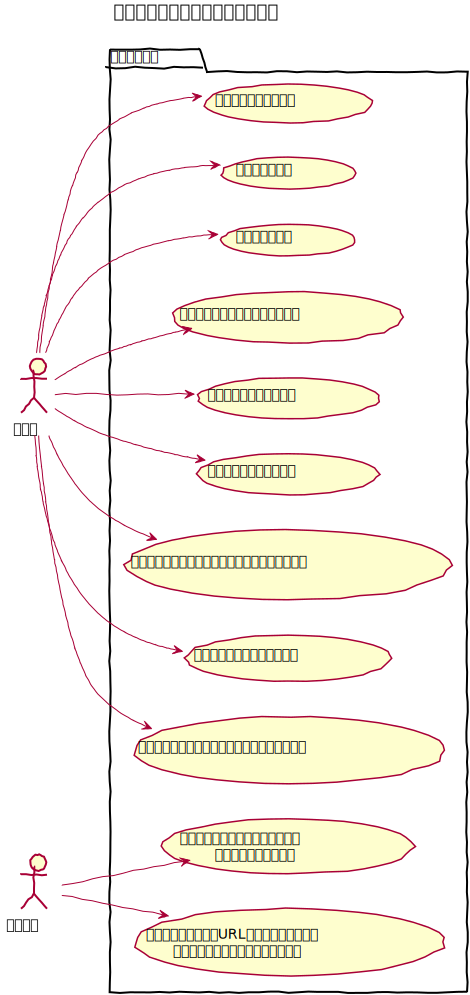
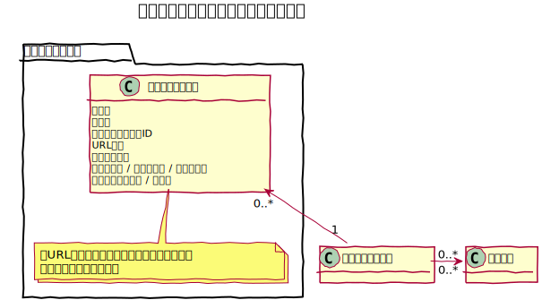
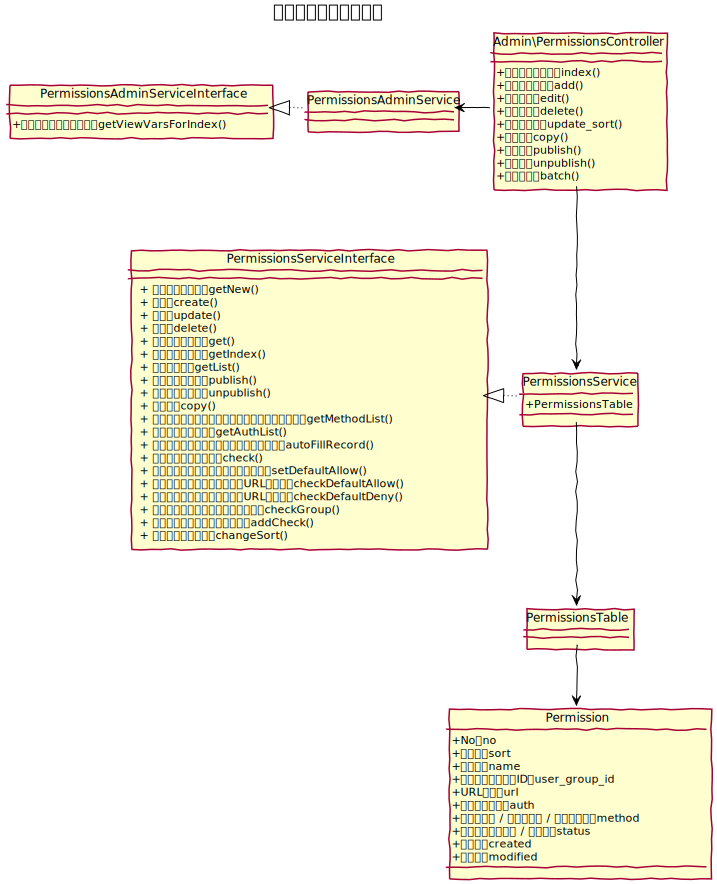
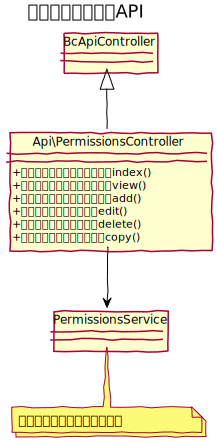

# アクセス制限設定設計書

管理画面における各機能についてのアクセス制限を設定する機能。

## 前提条件

- アクセス制限の対象は管理画面内とする。
- ユーザーグループに対してアクセス制限設定を登録できる。
- システム管理グループ（admins）に対しては登録できない。
- 設定については管理者のみ登録、変更ができる。

## ユースケース図


　
## 機能
### 一覧
指定したユーザーグループのアクセス制限設定一覧を表示する。  
また、アクションとして次の機能を提供する。
- 新規登録（画面に遷移）
- 編集（画面に遷移）
- 有効化・無効化（処理完了後一覧に遷移）
- 複製（処理完了後一覧に遷移）
- 削除（処理完了後一覧に遷移）

システム管理者のみ実行可能。

### 新規登録
新しいアクセス制限設定を登録する事ができる。  
システム管理者のみ実行可能。

### 編集
既存のアクセス制限設定を編集する事ができる。  
システム管理者のみ実行可能。

### 有効・無効化
既存のアクセス制限設定、有効化、または、無効化する事ができる。  
システム管理者のみ実行可能。

### 複製
既存のアクセス制限設定を複製する事ができる。  
システム管理者のみ実行可能。

### 削除
既存のアクセス制限設定を削除する事ができる。  
システム管理者のみ実行可能。

### 一括処理
一覧上のアクセス制限設定を任意に指定して一括処理（有効化、無効化、削除）を行う事ができる。

### 適用順並べ替え
アクセス制限設定判定時の適用順を一覧で並べ替える事ができる。

### 対象画面をアクセス制限設定対象に登録
管理画面の各画面を表示時に、対象画面のURLをアクセス制限の対象として登録する事ができる。

### リンク表示切り替え
管理画面内のリンクを表示する際、現在のログインユーザーに設定されたアクセス制限設定を参照し、
対象リンクのURLがアクセス可能かどうかを判定する。

アクセス可能な場合は、リンクを表示し、アクセス不可の場合は、表示しない。  
`BcBaserHelper::link()`、`BcBaserHelper::getLink()` を利用している場合のみ上記処理を適用する。

### 非許可時処理
管理画面内のURLにアクセスする際、現在のログインユーザーに設定されたアクセス制限設定を参照し、
対象リンクのURLがアクセス可能かどうかを判定する。

アクセス可能な場合は、アクションを実行し、アクセス不可の場合は、ダッシュボードにリダイレクトする。

　
## アクセス制限手法

### 設定内容

管理画面内のURLのメソッドについて、許可、もしくは非許可を設定できる。  
なお、URLについてはワイルドカードが利用できる。

- *：全て
- GET：表示のみ
- POST：表示と編集

```shell
/admin/users/*
```

### 設定適用

複数の設定を登録することができ、設定順の上位より設定を上書き適用する

```shell
# 下記設定の場合
# /admin/ はアクセス不可
# /admin/users/index はアクセス可
# / admin/users/delete/1 はアクセス不可

/admin/* : 非許可
/admin/users/* : 許可
/admin/users/delete/* : 非許可
```


　
## ドメインモデル図
### アクセス制限設定管理


　
## クラス図
### アクセス制限設定管理


　
### アクセス制限設定API

