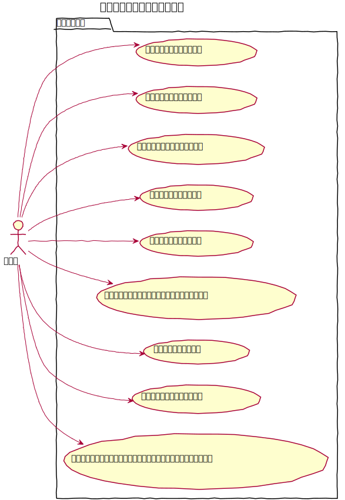
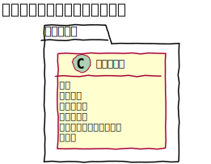
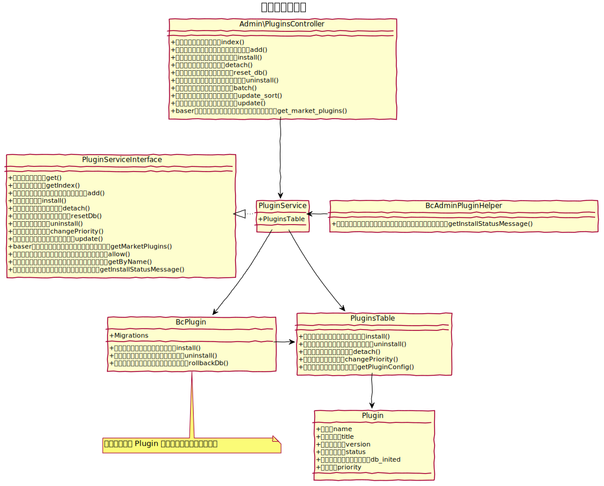

# プラグイン設計書

プラグインを管理する。
　
## 機能
### 管理機能
一覧、新規登録、インストール、無効化、有効化、削除の機能を提供する。

#### 新規登録
Zipファイルのプラグインをアップロードすることができる。
#### インストール
全てのユーザーで利用、管理ユーザーのみ利用で選択ができる。
#### 無効化
プラグインのファイルは残り、データベースのデータも残った状態となる。
#### プラグインのデータを初期化
プラグインの有効化の際、データベースのデータを初期化することができる。
#### 一括無効化
プラグインのうち選択したものを一度に無効化できる。
#### 並べ替え
プラグインからイベントにイベントリスナーを設定している際の実行順序を変更することができる。
　
### baserマーケット
baserマーケットのプラグインを表示する。
　
## ユースケース図

　
## ドメインモデル図

　
## クラス図

