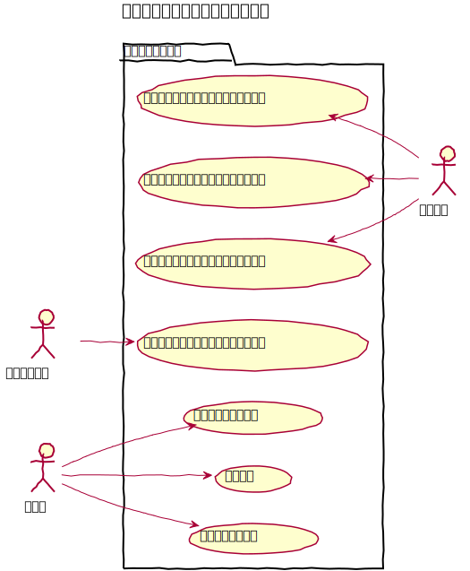
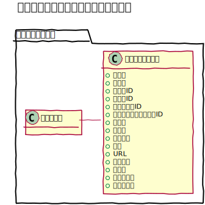
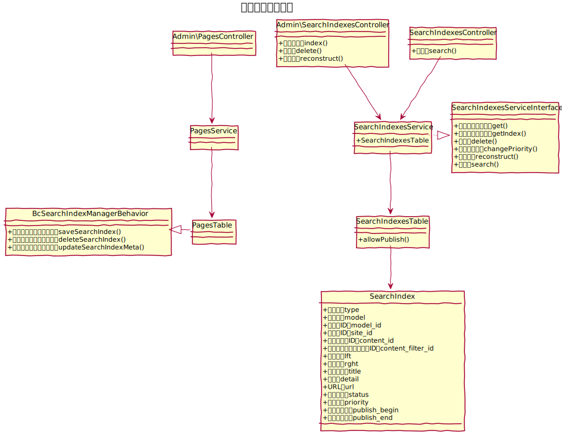

# 検索インデックス設計書

検索インデックスはサイト内検索を行うためのデータを指す。   
固定ページの他、各種プラグインのデータを横断して検索する事を可能とするため、
各コンテンツの作成時に検索インデックスにも検索用のデータを作成する。  
また、更新時、削除時にも検索インデックスに対して反映を行う。

## ユースケース図

　
## 機能
### コンテンツ作成時に連携して作成する
新規コンテンツを作成する際に、検索インデックスを作成する。
対象テーブルにて、`BcSearchIndexManagerBehavior::saveSearchIndex()` を利用して保存する。

### コンテンツ更新時に連携して更新する
コンテンツを更新する際に、検索インデックスを更新する。
対象テーブルにて、`BcSearchIndexManagerBehavior::upadteSearchIndex()` を利用して更新する。

### コンテンツ削除時に連携して削除する
コンテンツを削除する際に、検索インデックスを削除する。
対象テーブルにて、`BcSearchIndexManagerBehavior::deleteSearchIndex()` を利用して削除する。

### 検索・一覧表示する
検索インデックス一覧を表示する。
タイプ、サイト、フォルダ、キーワード、公開状態、優先度で検索ができる。

### 削除する
検索インデックスを削除する。

### 優先度を変更する
フロントページでの検索時に上位表示させるための優先度を変更する。  
`Api\SearchIndexesController::change_priority()` を利用してAjaxで更新する

### フロントページで検索・一覧表示する
フロントページにて、サイト、フォルダを指定してキーワード検索ができる。表示の際は、優先度順とする。

　
## ドメインモデル図

　
## クラス図

