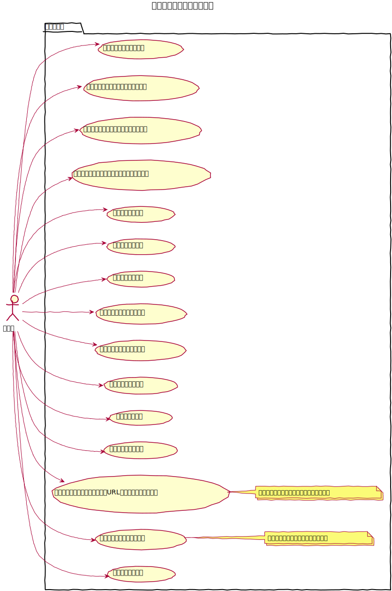
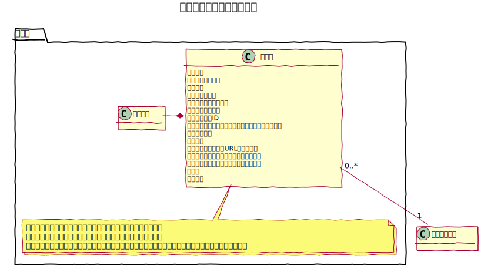
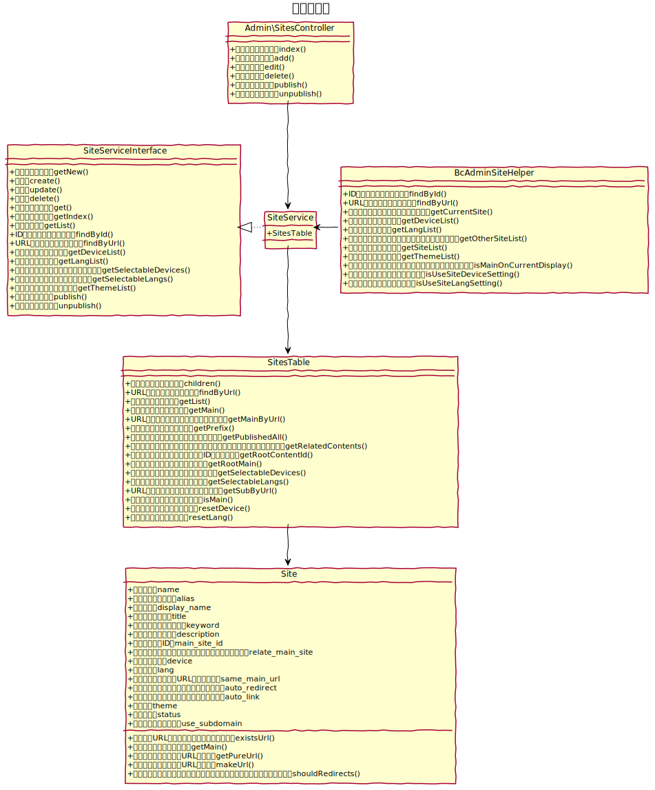
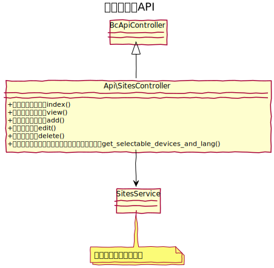

# サイト設計書

複数のサイトを管理する。

## ユースケース図

　
## 機能
### 一覧
サイトの一覧を表示する事ができる。  
またアクションとして次の機能を提供する。
- 新規登録（画面に遷移）
- 編集（画面に遷移）
- サイト確認（別タブで表示）
- 公開（公開後は一覧に遷移）
- 非公開（公開後は一覧に遷移）

システム管理者のみ実行可能。

### 新規登録
新しいサイトを登録する事ができる。  
システム管理者のみ実行可能。

### 編集
既存のサイトを編集する事ができる。  
システム管理者のみ実行可能。

### 削除
既存のサイトを削除する事ができる。  
システム管理者のみ実行可能。

　
### サイトアクセス
サイトのエイリアス名を利用してサイトにアクセスするためのURLを提供する。

#### サブフォルダ
- サイトエイリアス名なし：https://example.com/
- サイトエイリアス名あり（en）：https://example.com/en/

#### サブドメイン
sites テーブルの `use_subdomain` を true に設定し、`domain_type` を 1 に設定
- サイトエイリアス名あり（en）：https://en.example.com/

#### 別ドメイン
sites テーブルの `use_subdomain` を true に設定し、`domain_type` を 2 に設定
- サイトエイリアス名あり（example.com）：https//example.com/

　
### エイリアス連携
「エイリアスを利用してメインサイトと自動連携する」にチェックを入れると、メインサイトでコンテンツを作成した際、対象サイトの同階層にメインサイトの同階層のコンテンツへのエイリアスを自動生成する。

　
### デバイス・言語設定
スマートフォン、英語など、サイトの属性を設定できる。  
サイト基本設定の「サイト設定」→「デバイス・言語設定」より有効化することで利用できるようになる。

#### アクセス設定
##### メインサイトと同一URLでアクセス  
メインサイトと同一URLでアクセスし、デバイス設定や言語設定を判定し、適切なサイトを表示する。  

例えば、デバイス設定をスマートフォンに設定したサイトを準備し、https://example.com/ にアクセスするとスマートフォン用のサイトを表示する。  
※ デバイスと言語で利用可能

##### メインサイトから自動的にリダイレクト
メインサイトと別URLでアクセスする際、デバイス設定や言語設定を判定し、適切なサイトへリダイレクトする。
  
例えば、デバイス設定をスマートフォンに設定したサイトエイリアス名「sp」のサイトを準備し、https://example.com/ にアクセスすると https://example.com/sp/ にリダイレクトする。  
※ デバイスと言語で利用可能

##### 全てのリンクをサブサイト用に変換する
メインサイトと別URLでアクセスし、エイリアスを利用して同一コンテンツを利用する場合、コンテンツ内の全てのリンクを対象サイト用に変換する。
  
例えば、デバイス設定をスマートフォンに設定したサイトエイリアス名「sp」のサイトを準備し、エイリアスで作成されたページ https://example.com/sp/ にアクセスした場合、/about への内部リンクを /sp/about に自動変換する。  
※ デバイスのみで利用可能
　
## ucmitzにおける仕様変更

baserCMS4までは、メインとなるサイトの情報はサイト管理では管理せず、サイト基本設定に保存していたが、ucmitzでは、メインとなるサイトもサイト管理で管理するようにする。

　
## ドメインモデル図
### サイト管理

　
## クラス図
### サイト管理

　
### サイト管理API

