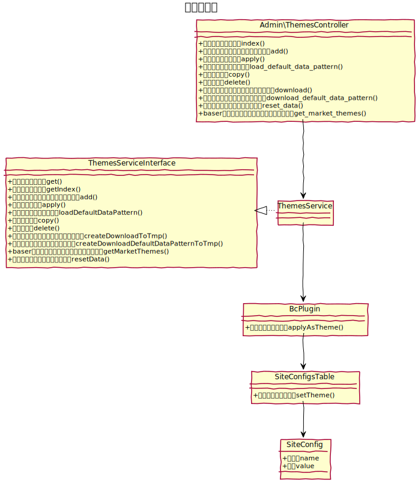
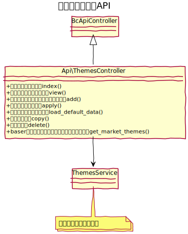

# テーマ管理設計書

baserCMSのデザインテーマの管理を行う。  
フォルダベースの管理としデータベースのテーブルは持たない。

## ユースケース図


## 機能
### 一覧表示
テーマの一覧を表示する。現在適用しているものは上部に適用状態として表示する。

### 新規追加
Zip化されたテーマをアップロードし、解答した上で一覧に表示する。

### 詳細表示
テーマの詳細情報を表示する。  
テーマフォルダ直下に配置した、`config.php` を読み込む。

### 適用
指定したテーマを適用状態にする。値は、`site_configs` テーブルに保存する。

### 初期データ読み込み
テーマが保有する初期データを読み込む。  
初期データはCSV形式とし、複数保有する事ができる。

```shell
# 初期データのフォルダ例
/plugins/theme-name/config/data/default/
/plugins/theme-name/config/data/sample/
```

### コピー
指定したテーマをフォルダごとコピーする。

### 削除
指定したテーマを削除する。現在適用しているテーマは削除できない。

### 利用中テーマダウンロード
利用中のテーマをZipで圧縮してダウンロードする。

### テーマ用初期データダウンロード
現在のデータベース上のデータをテーマ用の初期データとしてZipで圧縮してダウンロードできる。

### コアの初期データを読み込む
コアテーマが保有する初期データを読み込む。

### baserマーケットのテーマ一覧を表示
baserマーケットのテーマを表示する。

　
## ucmitzにおける仕様変更
- テーマ設定は別プラグイン化（bc-theme-config）
- テーマファイル管理は別プラグイン化（bc-theme-file）

　
## クラス図
### テーマ管理


　
### テーマ管理API

