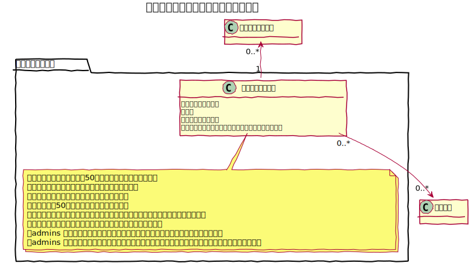
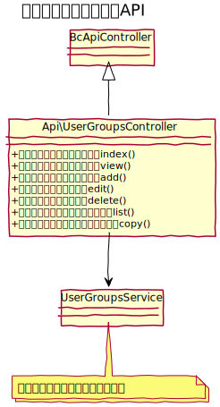

# ユーザーグループ設計書

ユーザーを取りまとめるユーザーグループを管理する。

## ユースケース図

　
## 機能
### 一覧
ユーザーグループの一覧を表示する。  
また、アクションとして次の機能を実行する事ができる。なお、`admins` グループは特別なグループとして、削除、および、アクセス制限の設定はできない。
- ページネーション
- 表示件数切替
- 表示並び替え
- 登録（画面へ遷移）
- 編集（画面へ遷移）
- コピー（コピー後は一覧に遷移）
- 削除（削除後は一覧に遷移）
- アクセス制限設定（アクセス制限一覧画面へ遷移）

システム管理者のみ実行可能。

### 新規登録
新しいユーザーグループを登録する。  
システム管理者のみ実行可能。

### 編集
既存のユーザーグループを編集する。なお、`admins` グループは特別なグループとして、ユーザーグループ名の変更はできない。  
システム管理者のみ実行可能。

### 削除
既存のユーザーグループを削除する。削除時には対象グループに紐づくアクセス制限設定も削除する。  
システム管理者のみ実行可能。

### コピー
既存のユーザーグループをコピーする。コピー時には対象グループに紐づくアクセス制限設定もコピーする。  
システム管理者のみ実行可能。

### 認証プレフィックス
baserCMSでは、認証プレフィックスの設定により、管理画面以外の認証領域を作成できるが、ユーザーグループごとにどの領域に対してログイン可能かを設定できる機能。

　
## ドメインモデル図
### ユーザーグループ管理

　
## クラス図
### ユーザーグループ管理

### ユーザーグループ管理API

